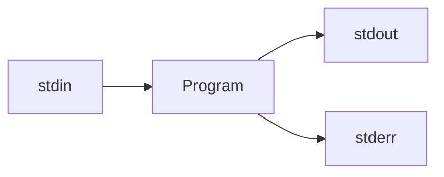

# Module 1: Linux 

*Recall*: Every process is connected to *three streams*.



***Command line arguments***: program recieves immediately when it starts

> 1. `stdin` (standard out) = keyboard, redirected by `<`
> 2. `stdout` and `stderr` = screen, and redircted by `>` and `2>` respectively 

`stdout` may be buffered - the system may accumulate output before sending it out to the OS for printing, this consumes time as "context switching" to give the OS control to so somethig (printing or allocating memory tp the program) is expensive
> Additionally, this allows for error messages to be sent to seperate locations, so regular output can maintain its formatting withoout error messages in between 

*Example A*. 
``` bash
myProg < infile > outfile 2> errfile
```
But, what if we want to run one program with the inout from another program?

```bash
Prog1 > filename
Prog2 < filename
```

## 1.1 Pipes
> ***Pipes*** allow us to ouse the output of one program as the input to another (<span style="background-color: #FFFF00">`|` is the pipe character</span>) 

*Example 1*. How many words occur in the first 20 lines of Alice in Wonderland? 

- `head -n file`: gives the first `n` lines of a file 
- `wc`: counts words, lines and characters, `-w` counts just words 

``` bash
head -20 alice.txt | wc -w // gives the number of words in the first 20 lines of alice.txt
```

*Example 2*. With `words1.txt` and `words2.txt`

*2.1* Print both text files: <span style="background-color: #FFFF00">(globbing patterns)</span>
```bash 
cat words*.txt
```

*2.2* Print both text files *without duplicates*: 
```bash 
cat words*.txt | sort | uniq

> rundown: cat words*.txt (combine) | sort (sort) | uniq (remove adjacent duplicates)
```


So, we can use the output of one patter as the *input* to another, can we also use it as the argument(s) of another program? ***Subshells*** 

## 1.2 Subshells 
> A ***subshell*** is created with the `$(...)` syntax

In the parenthesis `(...)` goes whatever you want to run, then the subshell gets in the outer command with the text it printed 

*Example 1*. 
``` bash
echo "Today is $(date) and I am $(whoami)"
```
Here, the shell executes the commands `date` and `whoami` and substitutes their output into the comand line 

*Example 2*. 
``` bash
echo hello there
``` 
(`hello` and `there` are 2 **distinct** command line arguments) 

> There is a difference between double (`""`) and single quotes (` '' `): <span style="background-color: #FFFF00">No BASH substitution occurs in single quotes</span>

``` bash 
echo "Today is $(date) and I am $(whoami)"
> Today is May 05 2022 and I am Grace

echo 'Today is $(date) and I am $(whoami)'
> Today is $(date) and I am $(whoami)
```

*Example 3.* Let `temp.txt` be 
``` bash 
hello
there
```

``` bash 
echo $(cat tmp.txt)
> hello there

echo "$(cat tmp.txt)"
> hello
> there
```

``` bash
echo * 
> prints all non-hidden filenames in current wording directory 

echo "*" 
> prints *
```
Note: `cat` preserves the spacing of the given input, whereas `echo` may not

## 1.3 Pattern-Matching in Text Files (`egrep`)
> `egrep` ("extended global regular expression print"): prints every line in file that matches the pattern

Formatting: `egrep pattern file`

*Example*. Print every line in `index.html` that contains `cs246`

``` bash 
egrep cs246 index.html
> returns lines with `cs246` (case sensitive)

egrep "(cs|CS)246" index.html [OR] egrep cs246|CS246 index.html
> returns lines with `cs246` or `CS246`

egrep "(c|C)(s|S)246" index.html [OR] egrep "[cC][sS]246" index.html
> returns lines with all instances of `cs246` (not case sensitve) 
```

==The patterns that `egrep` are called **regular expressions** and are not the same as globbing patterns==

| Syntax | Property |
|---|---|
| `[...]` | match any one charcter included in these brackets |
| `[^...]` | match any charcter **not** in these brackets |
| `?` | indicates ==0 or 1== occurances of the ==immediate preceeding pattern== |
| `*` | indicates ==0 or more== occurances of the ==immediate preceeding pattern== | 
| `+` | indicates ==1 or more== of the ==immediate preceeding pattern== | 
| `.` | match **any** single character |
| `.*` | matches any string (including the **empty string**) | 
| `.+` | matches any **non-empty** string | 

Note: `[cC][sS] ?246` allows for an optional space, but `[cC][sS] 246` requires a mandatory space

*Example*

``` bash 
egrep "cs?246" index.html
> looks for `c246`, `cs246`

egrep "(cs)?246" index.html
> looks for all occurances of the words with `246`

egrep "cs.*246" index.html
> fetches lines from `index.html` that contains `cs` followed by any sequence of charcaters, followed by `246`

> ✓ `cs246` `cs is fun, this is 246` `hello, cs gabagol 246 bye` `cs246 is a cs class`
> ✗ `246 is a cs class` (not a match incorrect order) 
```

The special patterns `^` and `$` match respectively with the beginning and end of a line. 

> Thus, the pattern `^cs246$` matches lines that begin and end with `cs246` with nothing in between. 
- `^cs246` matches any line that **starts** with `cs246`
- `cs246$` matches any line that **ends** with `cs246`

*Example*. Fetch all lines of even length from a file: 
``` bash 
^(..)*$
```

*Example*. Fetch the names of all files in current working directory whose name contains **exactly 1 a**: 
``` bash 
^[^a]*a[^a]*$
```

*Example*. Fetch all words in the global dictionary, that are 5 letters long and begin with 'e'
```bash 
$ egrep "^e....$" /usr/share/dict/words

if we dont want apostrophie
$ egrep "^e[^'][^'][^'][^']$"
```

# File Permissions 

``` bash 
ls shows all files (non-hidden) 
ls -a shows all files (including hidden) 
ls -al or ls -l shows the long form of directories 
```

The cmd `ls -al` gives the "long form" listing of all files in the directory (cwd) 

**The format for file permission display:**
``` bash 
-rw--r----- g7guo cs246 25 Sep 9 15:27 abc.txt
type/perms  owner group size  modified filename
```

- ***Type***: "`-`" for a *regular file* (*Ex*: `-rw-rwxr--`), "`d`" for a *directory* (*Ex*. `drw-rwxr--`)
- ***Permissions***: 3 groups of 3 bits (`rwxrwxrwx`)
  - *User bits*: apply to the file's owner 
  - *Group bits*: apply to the members of the file's group 
  - *Other bits*: apply to everyone else 
- ***Groups***: a user can belong to one or more groups, a file can be associated with one group


`r` - read bit, `w` - write bit, `x` - execute bit 

| Bit | Meaning for ordinary files | Meaning for directories
|---|------|---|
|`r`| File's contents can be read|Directory's contents can be read (e.g `ls`, globbing, text completion)|
|`w`|File's contents can be modified| Directory's contents can be modified (add/remove files)|
|`x`| File's contents can be executed as a program| Directory can be navigated (e.g can `cd` to it)|

Note: If a directory's executable bit is not set, then there is no access to that directory, nor to any file within it regardless of what other bits are set. 

## Changing permissions: 
```bash 
chmod <mode> <file>
```

The `<mode>` consists of three parts: 

|User types|Operators|Permissions|
|---|---|---|
|<ul><li>`u` = user (owner)<li>`g` = group<li>`o` = other<li>`a` = all<ul>|<ul><li>`+` = add permissions<li>`-` = subtract permissions<li>`=` = set permissions exactly<ul>|<ul><li>`r` = read<li>`w` = write<li>`x` = execute<ul>|

*Example* - Give others permission to read file: `chmod o+r <file>`

*Example* - Make everyone's permission to read and execute: `chmod a=rx <file>`

*Example* - Give owner full control: `chmod u+rwx <file>` or `u=rwx`

# Shell Scripts 
> **Shell scripts**: files containing a sequence of shell commands, executed as a program 

*Ex*. Print the date, current user and current directory 

**In a text file (program):**

~~~BASH
#!/bin/bash --> Shebang Line
date 
whoami
pwd
~~~

`#!/bin/bash` is the **Shebang line**: tells the OS `/bin/bash` is the location of the program you should use to interpret this file 

Then, give the file executable permissions: `chmod u+x myscript`

Execute the script: `./myscript`

> `.` represents the current directory 
> 
> `..` represents one directory higher than the current directory 
> > So `cd ../` goes up one directory

# Variables

*Example*.
```bash 
x=1
``` 
NOTE: No Spaces in between!

```bash 
echo $x
> 1
```

Notes: 
- `$`: fetches the value of → use `$` when fetching yje values of a variable
- No `$` when setting a variable 
- Good practice: `${x}` brace brackets
- All variables in BASH are ***strings*** (Ex. `x` contains the string "`1`")

~~~BASH
$dir = ./s22cs246 -- set dir as a variable
$echo $dir
> home/rob 

$ls $dir
> contents of my s22cs246 dir 
~~~

Note: `$` Expansion occur in double quotes `""` but not single quotes `''`

| Notation | Meaning |
|---|---|
| `$1`, `$2`, ..., etc | ***Special vars***: cooresponding cmd line args |
| `$?` | status of most recently executed command |
| `-eq` | arithmetic equality → treats variables like numbers |

*Example*. Check whether a word is in the dictionary or not: 
```bash 
./isItaWord hello
```

*Example*. Prints nothing if word is not found, otherwise, prints the word: 

~~~BASH
#!/bin/bash
egrep "n${1}$ /usr/share/dict/words
~~~

*Ex*. A good password should not be in the dictionary; answers whether a password is guarenteed bad or not 

~~~ bash 
egrep "^${1}$ /usr/share/dict/words > /dev/null

# Use '#' to comment in BASH
# Note: redirecting stout to /dev/null suppresses output
# Note: every program returns a status code to the OS when finished 
~~~ 

~~~ bash 
if [ $? -eq 0 ]; then 
	echo Bad password 
else 
	echo Maybe not a terrible password 
fi	
~~~

*Example*. Verify that there is a correct number of arguments, prints how to use the program otherwise 

~~~ bash 
#!/bin/bash 

usage() { # good idea to make usage a function in case you need to print in multiple places 
	echo "usage; ${0} password (and ${1})"}
	
if [ $# -ne 1 ]; then 
	usage
	exit 1
fi	
~~~

Be careful with spacing! There must be a blank space between the opening square bracket and the condition being tested, and a blank space between the condition and the closing square bracket.

# General Form of Statement 
General form of an `if` in bash 
```bash 
if <condition1>; then # use semicolon to separate "then"
	<statements>
elif <condition2>; then
	<statements>
elif <condition3>; then
	...
else
	<statements>
fi
```

For all available comparison and other conditions, see the LINUX reference sheet provided 

*Example*. Loops - print numbers from `1` to `$!`

~~~ bash 
#!/bin/bash
# usage ...
x=1
while [ $x -le $1 ]; do
	echo $x
	x=$((x+1)) #$((...)) is syntax for arithmetics 
done 	
~~~

Note: the special syntax `$(( ... ))` is used to tell the shell that the information within the doubled-parentheses are to be treated as integers (by default bash treats values as strings).

*Example*. Looping over a list 

*Example 1*: 

~~~ bash 
for x in a b c do echo $x; done 

> a
> b
> c
~~~

~~~ bash 
for x in abc; do echo $x; done 

> a
> b
> c
~~~

~~~ bash 
for x in "abc"; do echo $x; done 

> abc
~~~

*Example 2*: 

~~~ bash 
for x in $(ls) do echo "File: $x"; done 

> File: HelloScript 
> File: alice.txt
> File: myfile.txt
~~~

~~~ bash 
for x in "$(ls)" do echo "File: $x"; done 

> File: HelloScript
> alice.txt
> myfile.txt
~~~

~~~ bash 
#!/bin/bash 
for name in .cpp, do           # the glob *.cpp is replaced inline 
	mv ${name} ${name%cpp}cc   # with every .cpp file in cwd
done 
~~~

The `for ...in...` syntax sets the var to each word in the given list. The syntax `${name%cpp}` produces the value for the variable name without the trailing `cpp`

*Ex*. How many times does a word `$1` occurs in a file `$2`

~~~ bash 
#!/bin/bash
x=0
for word in $(cat $2); do
	if [ $word = $1 ]; then 
		x=$((x+1))
	fi
done 
echo $x	
~~~

*Ex*. Payday is on the last Friday of the month. Compute this month's payday. 

~~~ bash 
#!/bin/bash 
report() { #inside a fn $1 on denote the *fnc's* parameters
	if [ $1 - eq 31 ]; then 
		echo "This month: the 31st"
	else 
		echo "This month: ${1}st"
	fi
}

# compute the last Friday, and pass as an arg to report  
report $(cal $1 $2 | awk '{print 6}' | egrep "[0-9]" | tail -1)

# $(cal $1 $2 ...) -> $1 = month, $2 = year (vars)
~~~

Note that the `$1` outside of report was the scripts first cmd line arg, and in report it was the fcn's cmd line argument. 

-> `$0` does not change as it is the currently running program, and the fcn is not a program 

`awk '{print 6}'` -> prints the sixth column (friday column) of the calendar (fed inout) 

command in a command -> subshell 

# Testing 
- An essential part of program development
	- Ongoing - not just test at the end 
	- Begins before you start coding
	- Test suites test *expected behaviour* 
	- Continue to test while you code 
- **Testing is not debugging - cannot debug without testing** 
- In general, testing cannot prove the corectness of a program, can only prove wrongness 
- Is not easy: 
	- No general formula 
	- psycologucal barrier - don't want to find out your program is wrong 
	- ideally developer and tester should be different (not in this course) 

***Human testing:*** 

- Humans look over code, find flaws 
- Code inspection, walkthrough 
- Can't do this on assignments (save for rubber duck debugging) 

***Machine test:***

- run program on selected inpout, check against spec 
- Can't check everything: choose test cases carefully 
- Black/white/grey box testing - no/full/some knowledge of program implementation 
- Start with **black box** testing, then supplement with white box testing 
	- Various classes of input, e.g numeric ranges, positive, negative numbers 
	- Boundaries of valid ranges (edge cases), multiple simultaneous boundaries (corner cases) 
	- Intuition/experience - guess at likely errors 
	- Extreme cases (winthin reason: ex. overflow, underflow) 
- **White box** testing: 
	- Execute all logical paths through your program 

DO NOT TEST INVALID INPUT (in this course), unless a behaviour has been prescribed 

\! If the input is invalid, and there is no specifed behaviour, then there is no such thing as correct output 

***Program testing***: is the program efficient enough?

> ***Regression testing***: ensures new changes to the program do not break old functionality

- Typically use test scripts, testing suites 
- Always add, never subtract test cases 