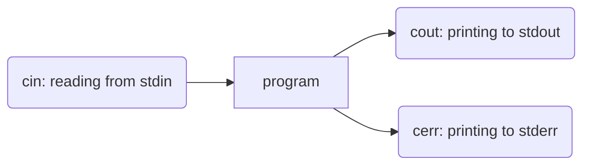

# Module 2: C++

`Hello World` in C: 

~~~c
# include <stdio.h>

int main() {
	printf("Hello World \n"); 
	return 0; 
}
~~~

`Hello World` in C++:

~~~c++
# include <iostream>
using namespace std; // standard function names (printf, etc.) 

int main() {
	cout  << "Hello World" << endl; 
}
~~~

`std::cout` instead of `cout` , and `std::endl` instead of `endl` if not using `namespace std`

When using `namespace std`, cannot create functions which repeat names used in `namespace std`

Notes: 

- `main` must return `int` in `C++`
- `stdio.h`, `printf` stil available in `C++`, we will not use 
- Preferred `C++` header is `<iostream>`
- Output: `std::cout << ____ << ____ << ...`
- Using `namespace std` allows for the omission of `std::` prefix
- Return statement: returns the status code to the shell (in `main`): (`$?`); can be omitted, `0` is assumed 

# Compiling C++ Programs (student.cs enviornment) 

```bash 
g++ -std=c++14 <program.cc> -o <program>
``` 
compiles `program.cc` into an executable program called `<program>`

The `-o <program>` indicated the name (`<program>`) of the resulting executable program. If not specified, then the compiler uses `a.out`

Most C programs work in C++, there is no review in this course 

# Input/Output 
### Three I/O streams 



### I/O operators

- `<<` = "put to" (output), e.g `cerr << X`
- `>>` = "get from" (input) e.g `cin >> s`
- The operator "points" in the direction data in flowing 

*Example*. Add two numbers together 

~~~c++
# include <iostream>
using namespace std; 

int main () {
	int x,y; 
	cin >> x >> y; 	// read in to x, then read in to y
	cout << x + y << endl; 
}
~~~

Notes: 

- `cin >>` ignores leading whitespace 
- `cin >> x >> y` gets 2 integers from `stdin` skipping whitespace 

What if the input dosen't end contain an integer next, or the input is out of range, or we run out of input before we get two integers (invalid input)?

Read fails, value of the variable is unchanged if read fails/`max/min int` is too large/small 

If the read fails: `cin.fail()` will be true 

If the read fails because `EOF` both `cin.fail()` and `cin.eof()` will be true - but not until the read fails 