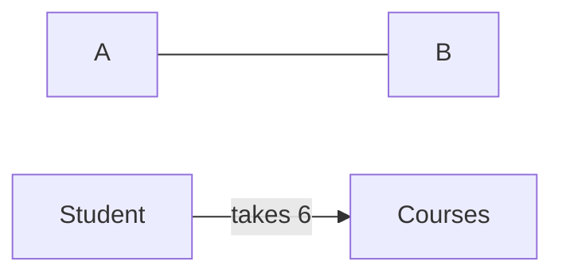

Note: copy cstr -> parameter is constant 

Remember: 

```c++
class MyC {
    ...
    public: 
        void foo(); 
        void foo() const;
    ...
}; 
```
Use of `const` overloads `MyC::foo`, so be careful!
- Can only call `const` methods on `const` objects [(More info here)](https://www.dataquest.io/)
- We distinguish between logical (visible to user) and physical (bit-wise change) constness 

*Example*: 
```c++
// studentBad.cc vs. student.cc
class Student {
    ...
    public: 
        float computeGrade() const; 
}; 
```

*Q*: What if we want to count the # of method calls on a particular Student object?

```c++
// StudentProfileBad.cc
...
int numMethodCalls = 0; 
...
float calcGrades() const; 
++numMethodCalls; // -> physical change so physical "const-ness", but not logical
```
Declare `numMethodCalls` to be "mutable": 
```c++
mutable int numMethodCalls = 0;
```
Now we can chnge mutable fields of `const` objects!

> May wasnt to draw a line between physical constness(any change), and logical constness (the things that are meaningful to the user): **`mutable` for physical constness** 

# Static Members
- If a data field is static, it is **shared** (not copied) across all instances/objects of the class
- [06-classes/06-static]

*Example*: make `Student::numMethodCalls` static

- All objects can access static data
- Can also be accessed through the class (Example: `Student::numMethodCalls`)
  - If we want to access a **non-public `static` data**, we need a `static` method
- Note: the data field in `Student::numMethodCalls` is now a **declaration**, not a defintion 
  - Put definition and initialization in `.cc` file

Note: `studentStatFun.{h, cc}`
- **Declaractions** are prefixed with `static`
- **Defintions** don't repeat `static`

# System Modeling 
Use the Unified Modeling Language (UML) class modeling

We are using a simplified version that isn't standard - supposed to be language-independent/agnostic: 
- Integer instead of int
- Muliplicities rather than pointers
- Classes can be represented at different levels of abstraction: (Textbook pg. 276 for diagram)
  1. Just the name (Figure 5) 
  1. Name and data (Figure 3)  
  2. Name and methods (Figure 4)
  3. Name, data, and methods (Figure 2)
- Because a class shluld always have: constructor(s), destructor, accessors, mutators, we don't list them in the class model
  
> Class digram notes: `-` for private, `+` for public

## Relationship Types
- Dependency: short-term temporary realationship
```c++
A: a;
a.foo(B& b); 
```
- Association: most basic form of relationship


Note: `6`: multiplicity

- Can put arrowheads on association line (->, <-, <->)
- multiplicites add constraints to the association

| Multiplicities | Constraints |
|---|---|
| `*` |  0 or more |
| `0..1` | 0 or 1 (pointer) |
| `m..*` | `m` or more |
| `m..n` | `m` to `n` |
| `m` | exactly `m` |

## Composition Relationships
> Composition Relationship: strong ownership relationship, with **no sharing**
- When destroyed, destroys components

```mermaid
classDiagram
class Student {
  int id
  string username
  size()
}