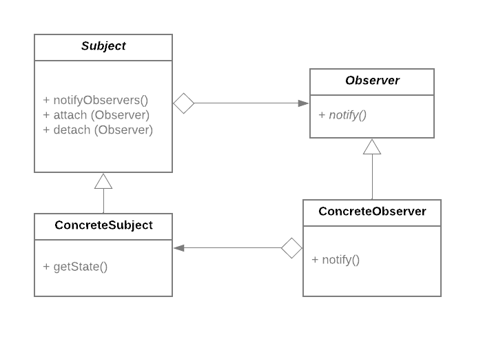
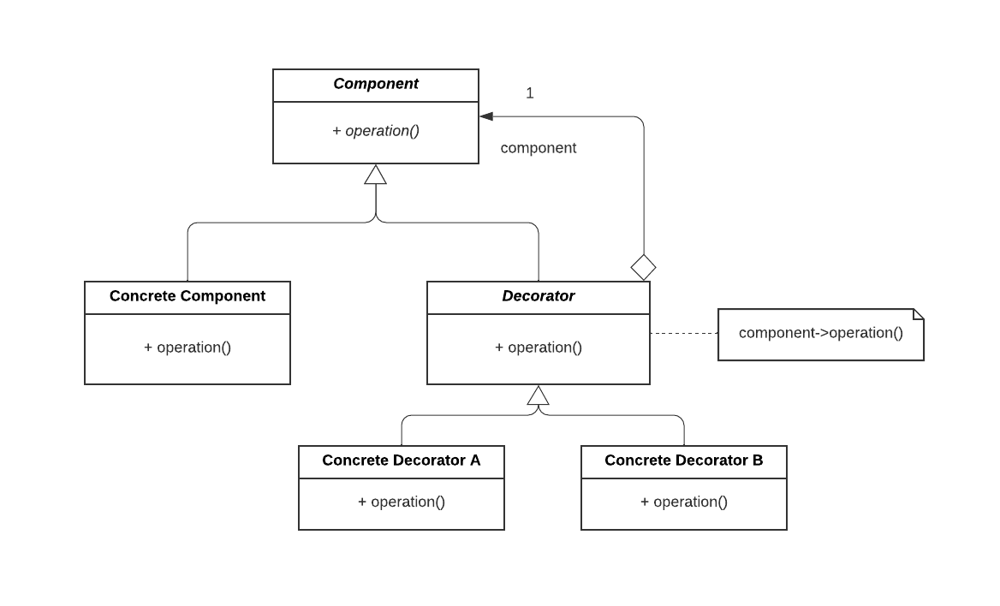
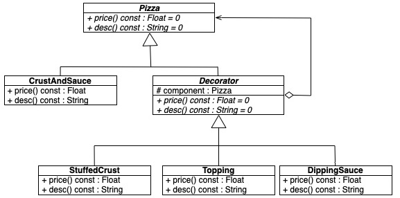

## Observer Pattern
### Publish - Subscribe Model
- One class: publisher/subject - generates data
- One or more: Subscriber/observer classes - recieves data and react to it

Example: publisher spreadsheet cells, observers are graphs or formula cells, when the cells change, the graph/formulas cells update themselves

There can be many different types of observer classes, and the subject should not need to know all the details about them

Observer Pattern: 



The abstract class subject contains all the code commmon to alll subjects - the abstract observer contains the interface common to all observers 

*Sequence of method calls:*
1. Subject's state is changed
2. `Subject::notifyObservers` is called, (either by the concrete subject when the change happens, or by the client when they change the subject)
3. `notfyObservers` call `notify` on each observer
4. Each `ConcreteObserver::notify` gets the data from their subject (e.g with `getState`) and react accordingly

*Example:* Horse races. The subject publishes the winner, the observes are individual bettors who react to winning or losing.

```c++
class Subject {
    vector<observer *> observers;
    public:
        Subject(){}
        void attach(Observer *ob){ observes.emplace_back(ob); }
        // assume each pointer shows up only once in our vector
        void detach(Observer* ob) {
            auto it = Observers.begin();
            for (it; it != Observers.end() && *it != ob; ++it) {
                if (it==observers.end()) return;
                Observers.erase(it);
            }
        }
        void notifyObservers() {
            for (auto p: Observers) p->notify();
        }
        virtual ~Subject() = o;
}; 

Subject::~Subject(){}
```

If you want a class to be abstract, but don't natrually have a method to make pure virtual, make the destructor pure virtual (since it should always be virtual if you have inheritance). However, the destructor still needs an implementation or your code won't link.

```c++
class Observer {
    public: 
        virtual void notify() = 0;
        virtual ~observer(){}
}; 

class HorseRace : public Subject {
    ifstream in; // source of data
    String lastWinner;
    public:
        HorseRace(const String &source) : in{source}{}
        ~HorseRace(){}
        bool runRace() {
            bool b = in >> lastWinner;
            notifyObservers();
            return b;
        }
        String getState() const { return lastWinner; }
};

class Better : public Observer {
    HorseRace *hr;
    String myName, horse;
    public:
        Better(...) : ... {
            hr->attach(this); // tells the subject, we're observing it
        }
        void notify() { // get the state and react to the data
            String winnner = hr->getState();
            cout << myName << (winner == horse ? "wins" : "loses"); 
        }
        ~Better() { hr->detach(this); }
}
```

## Decorator Pattern
Suppose we want to enhance an onject at runtime (e.g  add or change features). For example, a windowing system - we could start with a basic window, and have the options to add a scrollbar or a menu. We would like to choose these obtions at runtime.

Any combination (e.g basic window, basic window + scrollbar, basic window + scrollbar + menu)

Adding these at runtime means we could start with just a basic window and add a scrollbar when it becomes nessessary for example.

### The Decorator Pattern



class `Component` defined the interface: operations your objecs will provide. `ConcreteComponent` is your **basic, undecorated** object, so offers Based imples of these? 

The decorator classes all inherit from `Decorator` which inherits from `Component`.

*Example.* Pizza



```c++
class Pizza {
    public:
        virtual float price() const = 0;
        virtual String desc() const = 0;
        virtual ~Pizza(){}
};

class CrustandSauce : public Pizza {
    public:
        float price() const override { return 5.99; }
        String descr() const override { return "Pizza"; }
}; 

class Decorator : public Pizza { // decorator is a pizza and has/owns a pizza
    Pizza *component;
    public:
        Decorator(Pizza *p) : component{p}{}
        virtual ~Decorator{ delete component; }
        float price() const override {return component->price; }
        String descr() const override { return component->descr; }
}

class Topping : public Decorator {
    String theTopping; 
    public : 
        Topping(Pizza *p, String +) : Decorator{p}, theTopping{+}{}
        float price() const override {
            return Decorator::price() + 1.29;
        }
        float descr() const override {
            return Decorator::descr() + " with " + theTopping; 
        }
}; 

// stuffed crust is similar
```

