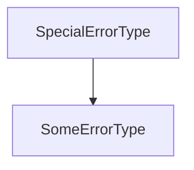

*Recall:*
```c++
void f(){
    throw out_of_range{"f"}; // "f" will be returned by out_of_range::what
}
void g() {f();}
void h() {g();}
int main() {
    try {
        n(); 
    }
    catch (out_of_range e){ cout << e.what() << endl; }
}
```
What happens? `main` calls `h`, `h` calls `g`, `g` calls `f`, then `f` raises `out_of_range`. Control goes back through the call chain (unwinds the stack), until a handler is found. In this case, goes all the way back to `main` and `main` handles the expection. 

If no matching handler is found, the program terminates. `out_of_range` is a class. The statement `throws out_of_range{"f"}` constructs the object and throws it as an exception. A handler can do part of the recovery job and throw another exception.

*Example.*
```c++
try { ... }
catch (someErrorType s) {
    ...
    throw SomeOtherError{...};
}
```

Or rethrow same exception: 
```c++
try {...}
catch (SomeErrorType s) {
    ...
    throw;
}
```

Why `throw` vs. `throw s`? 


(other direction)

The exception `s` might actually belong to a subclass of `SomeErrorType` rather than `SomeErrorType` itself. throw s would throw the local copy `s`, which is a sliced version of the original exception. On the other hand, `throw` would rethrow the same exception that was called, and it's type is maintained.

A handler can act as a catch all:
```c++
try {...}
catch (...) { // LITERALLY means ...
    ... // figurative ...
}
```

```c++
void fib(intn) {
    if (n == 0 || n == 1) throw 1;
    try {
        fib(n-1);
    } catch (int x) {
        try {
            fib(n-2);
        } catch (int y) {
            throw x+y;
        }
    }    
}
```

You can throw anything you'd like, not just objects. 

But generally exceptions should only be used for exceptional cases (errors that arise), you typically want a meaningfull error class, so define your own or use an appropriate existing one.

```c++
class BadInput {};
try {
    int n; 
    if (!(cin >> n)) throw BadInput{};
} catch (badInput &b){
    cerr << "input was not well formed" << endl;
}
```
*Note here:* this exception was caught by reference, this prevents the exception from being sliced (if it was sliced). Catching exceptions by reference is usually the right thing to do. The maxim in C++ is "throw by value, catch by reference". 

When `new` fails, it throw `std::bad_alloc`. Warning! NEVER let a destructor throw, by default, the program will terminate immediately because the compiler implicitly marks destructors as functions that should never throw.

It is possible to create a throwing destructor, by overruling this implicit decision. But, you still shouldn't do this: if a destructor throws as a result of it executing due to satck unwinding caused by another exception, you now have TWO active exceptions, progran will abort immediately, no other objects further down the call chain gets cleaned up.
