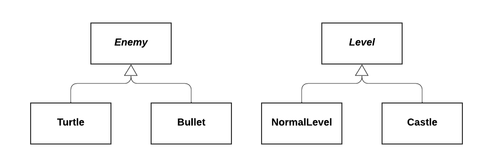

# Factory Pattern Method
Problem: write a video game with two types of enemies, turtles and bullets, the system randomely sends turtles and bullets, but bullets become more frequent in later levels.

 (*Enemy*, *Level* in italicts in UML)

Since we never know exactly what enemy comes next, we don't want to call constructors directly. Moreover, we don't want to hardcode the decision policy, as we want it to be customizable.

So instead, we put a factory method in `Level` that creates enemies. 

```c++
class Level {
    public:
        virtual Enemy *createEnemy();
}

class NormalLevel : public Level{
    public:
        Enemy *createEnemy() override {
            // create mostly turtles
        }
}; 

class Castle: public Level {
    public:
        Enemy *createEnemy() override() {
            // create mostly bullets
        }
}
```

# Template Method Pattern
Used when we want subclasses to override some aspects of superclass behaviour, but other aspects must stay the same.

*Example.* There are `Red` and `Green` turtles subclasses shouldn't change the way a turtle's head and feet are drswn, but can change the drawing of the shell.

```c++
class Turtle {
    public:
        void draw() {
            drawHead();
            drawShell()
            drawFeet();
        }
    private:
        void drawHead(){...}
        void drawFeet(){...}
        virtual void drawShell()=0;
        // yes, virtual methods can be private
}; 

class RedTurtle: public Turtle {
    void drawShell() override { draw red shell }
}; 

class GreenTurtle: public Turtle {
    void drawShell() override { draw green shell }
}
```

## Extension: Non-Virtual Interface (NVI) idiom
A public virtual method is really two things
- An interface to the client (public)
  - Indicates a promis of provioded behviour, class invariants, pre/post conditions
- An interface to subclasses (virtual)
  - A "hook" for subclasses to insert specialized behaviour

Hard to seperate these two ideas if they're wrapped up in some function declaration

- What if you want to later seperate the customizable behaviour into two methods, with some non-customizable steps in between without changing public interfaces
- Your base class us making promises you can't keep, public interface may promise specific behaviour, but derived classes can change that by overriding it.

The NVI Idiom says:
- All `public` methods should be non-virtual
- All `virtual` methods should be `private` or at least `protected`
- Except, of course, the destructor.

Example. 
```c++
class DigitalMedia {
    public: 
        vitual void play()=0;
        virtual ~DigitalMedia();
}
```

Translated to NVI: 

```c++
class DigitalMedia {
    public: 
        void play() {
            checkDRM(); // Example (1)
            doPlay();
            showCoverArt(); // Example (2)
        }
        virtual ~DigtalMedia();
    private: 
        virtual void doPlay();
}
```

No if we need to exert extra control over play, we can do it: 
- Example (1). Add a DRM check before calling `doPlay`
- Example (2). We can add more "Hooks" by additonal virtual functions (`showCoverArt`)
- All this without changing public interface

It is much easier to take this kind of control over our virtual methods from the beginning, rather than to try to take it back later after code has been written.

The NVI idiom is effectively an extension of the template method pattern saying that all virtual methods should be in a non-virtual wrapper. Essentially, no downside as the wrapper only calls that virtual function any good compiler will optimize the extra function call

# SIL Maps
SIL Maps: For creating dictionaries

Example: map `string`s to `int`s

```c++
#include <map> // for unordered maps: #include <unordered_map>
using namespace std; 
...
map<string, int> m;
m["abc"] = 1;
m["def"] = 4;
cout << m["abc"] << endl; // 1
cout << m["ghi"] << endl; // key will be added if not found, value is default initialized (for ints, 0)

m.erase("abc");
if (m.count("def")) ... // 0 is not found, 1 if found
for (auto &p : m) { // sorted key order if map
    cout << p.first << " " << p.second << endl;
}
```
`p`'s ytpe here is `std::pair<string, int>` & pairs are defined in `<utility>`

Note: unordered map is faster than ordered map

```c++
int n; // unitialized 
int m{}; // zero initialized
```


