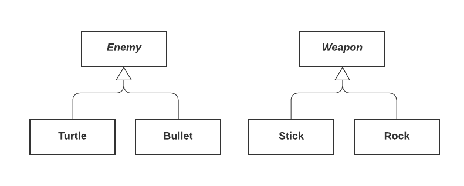

# Visitor Pattern
For implementing double dispatch. Virtual methods are chosen based on the run-time type of an object on which they're called. 

What if you want to call a method based on two objects?

*Example:* Striking enemies with weapons



We want something like
```c++
virtual void (Enemy, weapon)::strike;
```

But that isn't possible. If we write

```c++
virtual void Enemy::Strike(weapon &w);
```

the method is chose based on the enemy type, but not the weapon type. If instead, we write

```c++
virtual void Weapon::strike(Enemy &e);
```
then we choose based on weapon type but not enemy type. 

The trick to getting double dispatch is to combine overloading and overriding. 

```c++
class Enemy {
    public: 
        virtual void beStruckBy(Weapon &w) = 0;
};

class Bullet : public Enemy {
    public: 
        void beStruckBy(Weapon &w) {
            w.strike(*this); // strike with bullet argument
        }
};

class Turtle: public Enemy {
    public:
        void beStruckBy(Weapon &w) {
            w.strike(*this); // strike with turtle argument
        }
};

class Weapon {
    public:
        virtual void strike(Turtle &t) = 0; // OVERLOADING
        virtual void strike(Weapon &w) = 0;
};

class Stick: public Weapon {
    public: 
        void strike(Turtle &t) { 
            // strike turtle with a stick 
        }
        void strike(Bullet &b) {
            // strike bullet with a stick
        }
};

// Rock is similar

...

Enemy *e = ...;
Weapon *w = ...;

e->beStruckBy(*w);
```

What are the order for operations?

- Virtual dispatch for `beStruckBy` occurs, calling `Turtle` or `Bullet` `beStruckBy`
- The appropriate overriden method call `w.strike` on itself, the argumeny reference type is then a Bullet or a Turtle based on which method was chosen above
- Then the appropriate strike method is chosen based on virtual dispatch
- Our stick or our rock hits the Turtle or Bullet appropriately

The visitor pattern can be used to add functionality to existing classes without changing or recompiling them, so long as they offer the visit interface.

*Example:* Add a visitor to the `Book` hierarchy

```c++
class Book { // similar to Enemy -> this should be ABSTRACT, for the sake of space we will make it concrete
    public:
        virtual void accept(BookVisitor &bv) {
            v.vist(*this)
        }
};

class Comic: public Book {
    public:
        ...
        void accept(BookVistor &v) override { // similar to beStruckBy
            v.vist(*this);
        }
};

// Text is similar

class BookVisitor { // similar to Weapon - our overloads
    public:
        virtual void visit(Book &b) = 0; // similar to strike
        virtual void visit(Comic &c) = 0;
        virtual void visit(Text &t) = 0;
}
```

Application: track how many of each type of Book we have - group Books by author, texts by topic, and comics by hero.

```c++
struct Catalogue: public BookVisitor {
    map<string, int> theCatalogue;
    void visit(Book &b){ ++theCatalogue[b.getAuthor()]; }
    void visit(Comic &c){ ++theCatalogue[c.getHero()]; }
    void visit(Text &t){ ++theCatalogue[t.getTopic()]; }
}
```

Won't compile - why not?

`book.h` includes `bookvisitor.h`, which includes `text.h`, `text.h` includes `book.h` - a circular include!

Because of the header guard, `text.h` dosen't actually get a copy of `book.h`. So, the compiler dosen't know what a Book is when we define Text as a subclass.

But are all of these includes really nessessary? 

## Compilation Dependecies

When does a compilation dependecy exist, i.e when does a file REALLY need to include another?

Consider
```c++
// a.h
class A {...};

// b.h -> needs #include "a.h"
// size of B DEPENDS on size of A, hence must include
#include "a.h"
class B: public A {...};

// c.h -> needs #include "a.h"
// creates an A, requires the size of A, hence must include
#include "a.h"
class C { A myA; };

// d.h -> does not need #include "a.h" -> pointer is always 8 bytes
// can just forward declare class A
class A;
class D { A * myAp; }

// e.h -> does not need #include "a.h"
// f is a function DECLARATION: compiler DOES NOT need to generate code, hence compiler just needs to know A exists -> forward declare A
class A; 
class E { A f(A x); }

// f.h -> needs #include "a.h"
// taking A as a parameter, (for DEFINITION) compiler must generate code for this function -> compiler needs to know the size of A
#include "a.h"
class F { 
    A f(A x) {
        x.someMethod();
    }
}
```

Do not introduce compilation dependencies where they don't actually exist. Forward declare when possible, include only when nessessary.
