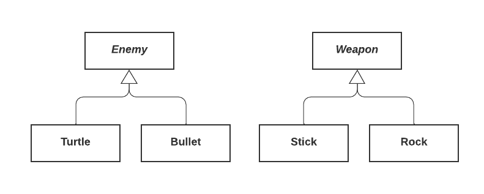

# Visitor Pattern
For implementing double dispatch. Virtual methods are chosen based on the run-time type of an object on which they're called. 

What if you want to call a method based on two objects?

*Example:* Striking enemies with weapons



We want something like
```c++
virtual void (Enemy, weapon)::strike;
```

But that isn't possible. If we write

```c++
virtual void Enemy::Strike(weapon &w);
```

the method is chose based on the enemy type, but not the weapon type. If instead, we write

```c++
virtual void Weapon::strike(Enemy &e);
```
then we choose based on weapon type but not enemy type. 

The trick to getting double dispatch is to combine overloading and overriding. 

```c++
class Enemy {
    public: 
        virtual void beStruckBy(Weapon &w) = 0;
}

class Bullet : public Enemy {
    public: 
        void beStruckBy(Weapon &w) {
            w.strike(*this); // strike with bullet argument
        }
}

class Turtle: public Enemy {
    public:
        void beStruckBy(Weapon &w) {
            w.strike(*this); // strike with turtle argument
        }
}

class Weapon {
    public:
        virtual void strike(Turtle &t) = 0; // OVERLOADING
        virtual void strike(Weapon &w) = 0;
}

class Stick: public Weapon {
    public: 
        void strike(Turtle &t) { 
            // strike turtle with a stick 
        }
        void strike(Bullet &b) {
            // strike bullet with a stick
        }
}

// Rock is similar

...

Enemy *e = ...;
Weapon *w = ...;

e->beStruckBy(*w);
```

What are the order for operations?

- Virtual dispatch for `beStruckBy` occurs, calling `Turtle` or `Bullet` `beStruckBy`
- The appropriate overriden method call `w.strike` on itself, the argumeny reference type is then a Bullet or a Turtle based on which method was chosen above
- Then the appropriate strike method is chosen based on virtual dispatch
- Our stick or our rock hits the Turtle or Bullet appropriately