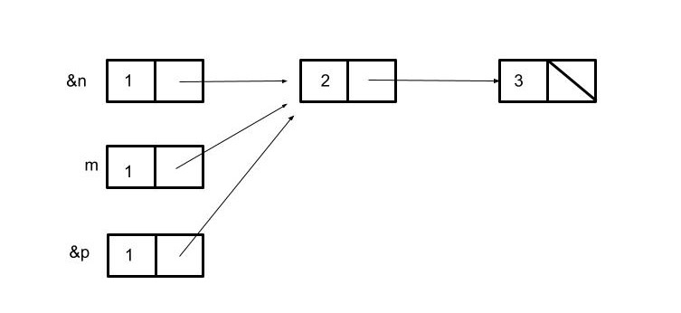
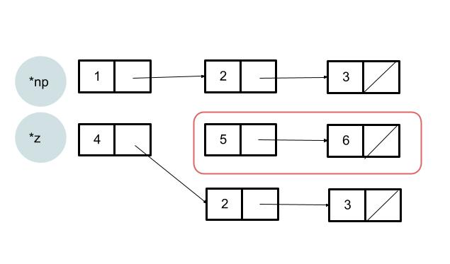

<style>
r { color: #F95050 }
navy { color: #000099 }
b { color: #50C1F9 }
o { color: #F7A63B }
g { color: #32a852 }
</style>

## Table of Contents <!-- omit from toc -->
- [Module 2 (Part 1): C++ Basics](#module-2-part-1-c-basics)
  - [Overloading](#overloading)
  - [References (very important!)](#references-very-important)
  - [Dynamic Memory Allocation](#dynamic-memory-allocation)
    - [Dynamic Array Allocation (Array Form)](#dynamic-array-allocation-array-form)
  - [Returning by Value/Pointer/Reference](#returning-by-valuepointerreference)
  - [Operator Overloading](#operator-overloading)
    - [Overloading `>>` and `<<`](#overloading--and-)
  - [The Preproccessor](#the-preproccessor)
    - [Constant Defintion](#constant-defintion)
    - [Conditional Compilations](#conditional-compilations)
  - [Module 2 (Part 2): Object Oriented Programming](#module-2-part-2-object-oriented-programming)
    - [Coupling and Cohesion](#coupling-and-cohesion)
  - [Classes](#classes)
  - [Initializing Objects](#initializing-objects)
    - [Uniform Initialization Syntax (Use `{}` as much as possible)](#uniform-initialization-syntax-use--as-much-as-possible)
    - [Default Parameters](#default-parameters)
  - [Default Constructor](#default-constructor)
    - [Initializing Constants and References](#initializing-constants-and-references)
    - [Member Initialization Lists (MIL)](#member-initialization-lists-mil)
  - [Copy Constructors](#copy-constructors)
  - [Perils of Single-Argument Constructor](#perils-of-single-argument-constructor)
  - [Destructors](#destructors)
  - [Copy Assignment Operator](#copy-assignment-operator)
    - [Copy-Swap Idiom](#copy-swap-idiom)
- [Move Semantic](#move-semantic)
  - [Move Constructor](#move-constructor)
  - [Move Assignment Operator](#move-assignment-operator)
  - [Copy/Move Elision](#copymove-elision)
  - [Rules for Replacing Default Compiler Operations](#rules-for-replacing-default-compiler-operations)
  - [Rule of 5](#rule-of-5)
  - [Member Operators](#member-operators)
  - [Static members](#static-members)
  - [Object Arrays](#object-arrays)
    - [Dynamic Arrays](#dynamic-arrays)
      - [Array on the stack:](#array-on-the-stack)
      - [Array on the heap](#array-on-the-heap)
  - [Constant Objects](#constant-objects)
  - [Mutable Fields](#mutable-fields)
    - [Good Practice:](#good-practice)
- [Invariant and Encapsulation](#invariant-and-encapsulation)
  - [`class` Keyword](#class-keyword)
    - [Assessor and Mutator Methods -> Get/Set methods](#assessor-and-mutator-methods---getset-methods)
- [Iterator](#iterator)

# Module 2 (Part 1): C++ Basics

## Overloading
> `Overloading`: Functions with different parameter lists can share the same name 
```c++
int neg(int a){ return -a };
bool neg(bool b){ return !b };
```
**Overloads** must differ in *number or type of parameter*, just differing in return type is not enough (compiler wont distinguish based on return types).

## References (very important!)
> `rvalues` vs. `lvalues`: If you can take the address of the expression, it is an lvalue; otherwise, it is an rvalue

Should pass by reference, rather than by pointer (so we don't need to derefence pointers all the time)
```c++
int x = 5; 
int &y = x; // the type of y is (int &), y is an alias of x
```
> `alias`: if y is an *alias* of x, then y is another name for x, and y behaves like x in all circunstances

Note: 
1. <r>**A reference is NOT a pointer**: a reference is an `lvalue` that acts as a constant pointer but the compiler *automatically dereferences* it</r>
   - Reminder: constant pointer - the address cannot change, but the contents of what the address points to can change
2. the ampersand `&` *in a type* means a *reference* (z is a reference: `int &z = y`), the `&` as an operator means the address of the variable (address of z: `&z`)

```c++
int y = 10; 
int &z = y; 
z = 12; // NOTE: NOT *z = 12, z is a reference as thus has automatic dereferencing - y  is now equal to 12
cout << y << endl; // Prints 12
```

Things that cannot be done with an lvalue reference: 
1. Cannot leave them unintialized (ex. `int &x`) - must be initialized with something that has an address (`lvalue`)
```c++
int &x = 3; // ILLEGAL: 3 does not have an address (rvalue)
int &x = y + z; // ILLEGAL: y + z is not stored somewhere in our program and does not have an address
int &y = y; // OKAY
```
2. <r>Cannot create a *pointer* to a *reference* (e.g `int &*x`), BUT can create a **reference to a pointer** (e.g `int *&x`)</r>
3. Cannot create a reference to a reference (e.g `int &&x`), actully has a different meaning
4. Cannot create an array or references
```c++
&refArray[3] = {x, y, z}; //illegal
```

Note: (`&*x`, `*&x`) is read from *right-to-left*
- `&*x` = `(&(*x))`: a pointer `(*x)` to a reference `(&(...))`
- `*&x` = `(*(&x))`: a reference `(&x)` to a pointer `(*(...))`

> *pass-by-reference*: passes the reference of an argument/return type

### Pass by Value <!-- omit in toc -->
> *pass-by-value*: copies the contents of the parameter/return value

<r>Prefer *pass-by-const-ref* over pass-by-value for anything larger than an int, unless the function needs to make a copy of it anyway. Then pass-by-value.</r>

```c++
struct ReallyBig { ... }; // struct that holds a *lot* of information
int f( ReallyBig rb ) { ... }  // Copies rb. Potentially slow; but see move/copy ellision later!
int g( ReallyBig &rb ) { ... } // Copies the alias. Fast; but, allows rb to be changed!
int h( const ReallyBig & rb ) { ... } // Fast. No copy and rb cannot be changed.
```

What if you wanted to pass a literal integer into a function that takes a reference?

```c++
int f(int & n) {...};
f(5) // NOT ALLOWED: implies you can change what is considered constant by the compiler

int g(const int & n) {...};
g(5); // ALLOWED: compiler creates a temporary location in memory to store the number 5, and n has something to refer to 
```

## Dynamic Memory Allocation
Allocating memory dynamically on the heap (C++ mechanisms): Use `new` and `delete`: are *type-aware*, less error prone, and more convenient

```c++
struct Node {
   int data;
   Node *next;
}

Node *np = new Node; // np is a variable on the stack, points to memory address of a Node on the heap
delete np;
```

```c++
#include <iostream>
using namespace std;

struct Node {
    int data;
    Node *next;
};

int main() {
   Node n{ 5, nullptr };
   Node * np = new Node{ 3, &n };
   cout << n.data << ' ' << np->data << endl;
   delete np;
}
```
Observe:

... ADD GRAPHS/DIAGRAMS

p.g 151 - 155

### Dynamic Array Allocation (Array Form)
variable `nodeArray` is a local variable stored on the stack
```c++
Node * nodeArray = new Node[10];
// An array of 10 Nodes on the heap
// nodeArray is a STACK-ALLOCATED pointer to the first node in the array 
...
nodeArray[0].data = 5;
nodeArray[0].next = nullptr;
...
delete [] nodeArray; // NOTE: square brackets
```
Note: 
- If memory is allocated with ordinary `new`, then must be deallocated with oridnary `delete`
- If memory is allocated with array form `new type[...]`, then it must be deallocated with the array form `delete[]`

<r>Mixing two forms of `new` and `delete` results in *undefined behaviour*.</r> ??(new array form, delete not array form -> only first element is freed - memory leak)??

## Returning by Value/Pointer/Reference
Three ways to return information from a function:
1. return by *value*
2. return by *pointer* 
3. return by *reference*

```c++
// Return by Value 
Node getMeANode(int value) {
   Node n{ value, nullptr };
}

// Return by Pointer 
Node * getMeANode(int value) {
   Node *nptr = new Node{ value, nullptr };
   return nptr;
}

Node * getMeANode(int value) { // INVALID (DO NOT DO THIS)
   Node n{ valid, nullptr }; 
   return &n; // Returns the address of a local, stack-allocated variable - which is POPPED OFF THE STACK WHEN RETURNING (Caller has address to invlid memory location - Crashes the program)
}

// Return by Reference
Node & getMeANode( int value ) {
   Node *nptr = new Node{ value, nullptr };return *nptr;
}
```

Which should you pick? <r>Most of the times *return by value*</r> - usually not as expensive as it looks

In general, avoid returning by reference - usually return a reference if it's something you already have a reference to (like a parameter that was passed in).

Why does `cin >> x` work? Because `>>` takes `x` *by reference* (i.e `std::stream &operator >> (std::istream &in, int &x);`)

## Operator Overloading
> `Operator Overloading`: like overloading functions, can also overload *operators*.

```c++
Struct Vec {
   int x, y;
};

Vec operator+(const Vec & v1, const Vec & v2) {
   Vec v{ v1.x + v2.x, v1.y + v2.y };
   return v;
}

int main() {
   Vec v1{3, 4}, v2{6, 7};
   Vec v3 = v1 + v2;
}
```
Similarly, can define `operator*` that multiplies a vector by an integer:
```c++
Vec operator*(const Vec & v, const int k) {
   return Vec{ k*v.x, k*v.y }; // can be invoked by v1*2, but not 2*v1, need a seperate overload for that with reverse params
}
```

### Overloading `>>` and `<<`
### output `<<` <!-- omit in toc -->
```c++
struct Grade {
   int theGrade;
}

std::osteam & operator <<(std::ostream & out, const Grade & g) {
   out << g.theGrade << '%'; // displays grade%
   return out;
}
```
Rules for writing output operator: 
1. return type is always (`std::ostream &`): allows us to cascade calls to the output operator on the stream <r>(NO `endl`)</r>
2. function name is always `<<`
3. first parameter is always output stream: *not constant*, because the contents of the output stream are being changed
4. second parameter is the information being output (constant)
5. return name of output stream 

```c++
Grade sue{95}; 
ofstream outfile{"final_grades.txt"};
...
outfile << "Sue's final grade is: " << sue << std::endl; // cascading calls
```
### input `>>` <!-- omit in toc -->
```c++
std::istream & operator>>( std::istream & in, Grade & g ) {
   in >> g.theGrade;
   if ( g.theGrade < 0 ) g.theGrade = 0;
   else if ( g.theGrade > 100 ) g.theGrade = 100;
   return in; 
}
```
Rules for writing input operator: 
1. return type is always (`std::istream &`)
2. function name is always `>>`
3. first parameter is always output stream: *not constant* - changes the input stream since it is consuming information from it
4. second parameter is the information being output (*not constant*): information is being added to it 
5. return name of input stream 

## The Preproccessor
The preproccessor's purpose is to control what code is included in your program - transforms the program *before* the compiler sees it.
```c++
#_______ - Preprocessor directive
e.g. #include
```

??To run only the preproccessor, use the `-E` flag to `g++` -> preprocessor will output to stdout.
```c++
$ g++ -std=c++14 -E name.cc
```
??

### Constant Defintion
```c++
#define VAR VALUE 
```
Sets a preproccessing variable to have a value, all occurances of `VAR` in the source file get replaced with `val`, excpt occurances in quoted string. 
``` c++
#define MAX 10
int x[MAX] // would be transformed to int x[10]
```

`#define FLAG` - sets the variable `FLAG`, its value is the empty string. *Defined constants (using preproccessors) are useful for conditional compiation.*

### Conditional Compilations
`#if ... (#elif) ... (#else) ... #endif` directive
``` c++
#include <string.h>
#define SECURITYLEVEL

#if SECURITYLEVEL == 1
short int 
#elif SECURITYLEVEL == 2
long long int 
#else
string
#endif
publickey; 
```
`#ifdef` checks if a preprocessor variable is *set at all*, opoosite of `ifdef` is `ifndef`.
```c++

```

- preproccessor defintions in cmd lines
- seperate comilations
- global vars
- make and makefiles
- preprocessor guards
- final remarks (3 bigGGGG POINTS!)

## Module 2 (Part 2): Object Oriented Programming

### Coupling and Cohesion
- Coupling: amount of dependencies between units/modules
- Cohesion: measure of "relatedness" that a module or unit of code contains
High cohesion, low coupling!

## Classes
> Class: user-defined type, that can potentially contain functions 
Object: an instance of a class

```c++
// student.h
#ifndef _STUDENT_H_
#define _STUDENT_H_
struct Student {
   int assns, mt, final;
   float grade();
};
#endif

// student.cc
#include "student.h"
  
float Student::grade() { // grade is a function of the Student class (Student::grade())
   return assns * 0.4 + mt * 0.2 + final * 0.4; 
}

// main.cc (client code)
#include "student.h"
#include <iostream>
int main() {
   Student s{ 60, 70, 80 }; // (uses the DEFAULT COMPILER) By default, the compiler maps the values to the data fields in the order they were declared, i.e. 60 to assns, 70 to mt, and 80 gto final 
   std::cout << s.grade() << std::endl;
}
```
To define the function `grade`, must use the <r>*scope resolution operator* `::`, prefixed by the class name</r> to specify that the *`grade` function is a METHOD of the `Student` class*

All class mehods have a hidden extra first parameter called <r>`this`, that is a ***pointer** of the class type* - `this` contains the *address of the object upon which the method is being invoked*.</r>

```c++
float Student::grade() {
   return assns * 0.4 + mt * 0.2 + final * 0.4; 
}
// is equivalent to 
float Student::grade() {
   return this->assns * 0.4 + this->mt * 0.2 + this->final * 0.4; 
}
```
Should only use `this->` to disambiguate a parameter/method

## Initializing Objects
> **Constructor**: method that initializes an object upon creation

- No return type, since youre building the actual object
- *Method name is the type name*
- Parameter list can be empty
- <r>Constructors can be overloaded</r>
- Method body may be empty, but must be present

```c++
// student.h
#ifndef _STUDENT_H_ // header guard
#define _STUDENT_H_
struct Student {
   int assns, mt, final;
   Student( int assns, int mt, int final );
   float grade();
}
#endif

// student.cc
#include "student.h"
int capGrade( int grade ) {
   if ( grade < 0 ) return 0;
   if ( grade > 100 ) return 100;
   return grade;
}

Student::Student( int assns, int mt, int final ) { // CONSTRUCTOR, the default constructor disappears
   this->assns = capGrade( assns ); // the object's assns field is set to the value of the parameter assns
   this->mt = capGrade( mt );
   this->final = capGrade( final );
}

float Student::grade() {
  return assns * 0.4 + mt * 0.2 + final * 0.4;
}; #endif
```
Note: in this case, without the `this->` (`assns = capGrade(assns)`), the compiler assigns the value to the parameter, rather than the object: may leave the data fields of the object unitialized.

### Uniform Initialization Syntax (Use `{}` as much as possible)
```c++
Student s{60,70,80};
int x{5};
std::dtring word{"hello"};
Node * ptr = new Node {10, nullptr};
```

### Default Parameters
```c++
// student.h
struct Student {
    ...
    Student(int assnc = 0, int mt = 0, int final = 0);
    ...
};

Student A{70, 80}; // A has annas 70 mt 80, final 0
Studetnt newKid; // object be constructed with no arguments -> 0, 0, 0

// Can call: Student s1{60,70,80}, s2, s3{60}, s4{60,70}

// student.cc
Student::Student(int assns, int mt, int final) {
    this->assns = assns;
    this->mt = mt;
    this->final = final;
}
```
Note:
- <r>default parameters must be last</r>
- The default params (i.e `int assns = 0`) only go on the interface, and not on the implementation

```c++
Student(int assns, int mt = 0, int final = 0); // VALID
// Note: cannot call Student s2;
// this specific constructor requires at least one argument

Student(int assns = 0, int mt, int final = 0); // INVALID
```

Constructor Advantages:
- Allows for default params
- Allows for overloading
- Allows for code other than simple field initialization

## Default Constructor
> Default constructor: constructor with 0 parameters

If you do not provide a constructor to the class, the compiler automatically gives a **default constructor**
- The default constructor initializes primitive data fields to 0
- And calls the default constructor on object data fields - if the object of a data field already has a constructor, then it fails 
- <r>The default constructor is no longer available as soon as you declare/define any other constructor</r>

```c++
struct Basis {
   char beep, boop;
   Vec v1, Vec v2;
};

struct Vec{
   int x, y;
   Vec( int x, int y ) {
      this->x = x;
this->y = y; }
};

Vec v1{5,6}; // OKAY
Vec v2; // NOT OKAY 

Basis b; // NOT OKAY (Vec does not have default constructor)

struct Vec{
   int x, y; 
}

Basis b; // OKAY (Calls Vec defualt constructor when initializing field v1,v2)
```

### Initializing Constants and References 
> Recall: <r>Constants and referneces must be initialized (including in structures)</r>

### Member Initialization Lists (MIL)
```c++
// student.h
#ifndef _STUDENT_H_
#define _STUDENT_H_
struct Student {
   const int id;
   int assns, mt, final;
   Student( const int id, int assns = 0,
            int mt = 0, int final = 0 );
   float grade();
};
#endif

// student.cc
#include "student.h"
int capGrade( int grade ) {
   if ( grade < 0 ) return 0;
   if ( grade > 100 ) return 100;
   return grade;
}
Student::Student( const int id, int assns, int mt, int final )
   : id{ id }, // MIL
     assns{ capGrade(assns) },
     mt{ capGrade(mt) },
     final{ capGrade(final) }
{}

float Student::grade() {
  return assns * 0.4 + mt * 0.2 + final * 0.4;
}
```
- Name *outside* of the `{}` in an MIL is the data field, the name *inside* then `{}` of the MIL is the parameter name
- MIL can be used to initialize most data fields, and constants and references
- Fields in the MIL are initialized *in the order which they are declared in the class*, even if the MIL orders them differently
- Using MIL can be more efficient than initializing in the body of the constructor (particularly true when **data field is an object that has a default constructor**)
  - For fields that are objects, if not listed in the MIL, then they are default constructed (first initialized with the dc when created, then reassigned in the constructor body) -> <r>avoids unessesary calls to the dc</r>

```c++
struct Student {
    string name; // <- first initialization (default constructor call)
    Student(const string &name) {
        this->name = name; // <- second initialization 
    }
};
```

- Initialization in the MIL takes precedence over initialization in the class
  - Why can we declare constants using MIL? class init is skipped

```c++
struct Student {
   ...
   const int studentID; // skips this "initialization"
   Student(int studentID) : studentID{studentID} {} // no "reinit" -> init only happens once
   ...
}
```

```c++
struct Vec { 
   int x = 0, y = 0; // THIS is initialization in the class 
   Vec() {} // (1)
   Vec( int x ) : x{x} {} // (2)
   Vec( int x, int y ) : x{x}, y{y} {} // (3)
};

Vec v{5}; // uses constructor (2) -> init in MIL (x=5) takes precedence over init in class (x=0)
// the init in the class (x=0) is skipped
// Therefore this creates a Vector with fields x=5, y=0
```

<r>**Note: MIL can only be used in constructors!**</r>

Gen Rule: If need sophisticated logic, loops, conditions -> use constructor body, otherwise use MIL

## Copy Constructors
Note: Every class comes with compiler provoded versions of 
- a default const (default-constr all fields which are objects, lost when we define a constr)
- a copy constructor (copies all fields)
- a copy-assignment operator (copy-assigns all fields)
- a move constructor
- a move-assignmeny operator
- a destrcutor

Copy constructor is a constructor - only parameter is a constant reference to a object of the same type

```c++
struct Student {
   const int id;
   int assns, mt, final;
   Student( const int id, int assns = 0, int mt = 0, int final = 0 )
      : id{id}, assns{assns}, mt{mt}, final{final} {}

   Student( const Student & other ) // COPY CONSTRUCTOR
      : assns{other.assns}, mt{other.mt}, final{other.final} {}
};
```
- Copy constructor: basically takes in another object of the same type as an argument, then copies nessessary parameters to create a new

When is a default copy not correct? 
```c++
struct Node {
   int data;
   Node * next;
   Node( int data = 0, Node * next = nullptr ) : data{data}, next{next} {}
};

// if we use the compiler provided copy ctor
Node *n = new Node{1, new Node{2, new Node{3, nullptr}}};

Node m = *n; // copy ctor; identical to "Node m{*n}"
Node *p = new Node{*n}; // copy ctor
```


Note: `n`, `m`, `p` are on the stack -> data they point to is on the heap

Built in copy constructor does a **shallow copy**, copies the fields, meaning th pointer for the next node is copied (all the nodes share have a pointer to the same next node)

Make a **deep copy** if the lists need to be independent of each other. <r>If you have a dynamically-allocated data strcuture and want a deep copy, write your own copy constructor.</r>

```c++
Node (const Node &n) {
   data = n.data; // n automatically dereferences
   if (n.next != nullptr) {
      next = new Node{ *n.next } // n.next is a pointer, hence when calling Node(...) again, we need to dereference it
   } else {
      next = nullptr;
   }
}

// OR
Node (const Node &n) : data{n.data}, next{n.next ? new Node{*n.next} : nullptr} {}
```

## Perils of Single-Argument Constructor
*Single-Argument Constructors* -> can be used to **implicitly convert** an argument of the specified type into an object of the constructor type

<r>Be careful with constructors with one parameter</r>

```c++
struct Node {
   ...
   Node(int data) : data{data}, next{nullptr} {}
};

Node n{4}; // Single argument constructor call
Node n = 4; // IMPLICIT CONV from int to Node via single-param constructor call

int f(Node n) {...}
f(4);  // 4 is implicityly converted into a Node
```

<r>Disable implicit conversion by labelling all single-argument constructors with the `explicit` keyword</r>

```c++
struct Node {
   int data;
   Node *next = nullptr;
   explicit Node(int data) : data{data} {} // Single-param w/ explicit
   Node(int data, Node *next): data{data}, next{next} {}
   ...
};

Node n{4};
Node myNode = 4; // ILLEGAL 
Node myNode = Node{4}; // OKAY
```

## Destructors
- Implicit (default) destructor: invoked automatically when an object on the run-time stack goes out of scope, whenever a heap-allocated memory for an object is freed
```c++
~class-name(); // Takes no params, returns nothing
```
The steps that are called when a destructor is run are:
1. Run the body of the destructor
2. Invoke destructors for the object's data fields that are themselves objects - will occur in reverse declaration
3. Deallocate the space associated with the object

When do we need to write our own?
```c++
Node *np = next Node{1, new Node{2, new Node{3, nullptr}}};
```
Notice: when `np` goes out of scope, the pointer is reclaimed (implicit destructor - since it is stack-allocated), but the nodes it points to (heap-allocated) are not, so they are leaked!

```c++
// node.h
struct Node {
   ...
   ~Node();
};

// node.cc
Node::~Node() { delete next; }

// main.cc
...
Node * n = new Node{ 1, { new Node{ 2, new Node{ 3 } } };
...
delete n;
```
Note: 
- <r>Initial call to `delete n` invokes the destructor of the first Node</r> in the linked list (Node with data `1`)
- Then, invokes destructor for the object's data fields `delete next` (recursive) -> which invokes the destructor for the next objects's data fields, ... 
- Automatically invokes the destructor for the Node we're on 

## Copy Assignment Operator

> Copy assignment vs. Copy constructor 
> - *Copy constructor*: **CREATES** a new object, by copying fields from one to another 
> - *Copy assignment*: Both objects are **ALREADY CREATED**, then copies fields of one to another

Class come with copy assignment operators that copy assigns all fields. It is a *shallow copy*

```c++
Student bill{ 60, 70, 80 };
Student jane{ bill }; // copy ctor used
Student fatima{ 78, 81, 76 };
bill = fatima; // copy, IS a copy assignment operator, IS NOT copy constructed (both bill and fatima are already created)

jane = bill = fatima; // (jane = (bill = fatima)) => jane = fatima: contents of fatima object is copies to bill, contents of bill object is copied to jane
```

```c++
class-type & operator=( const class-type & parameter-name );
```

A shallow copy is not always sufficient. Consider:
```c++
struct Node {
    int data;
    Node *next;
    ...
    Node &operator=(const Node &other) {
        // NOTE, the first operand is the node pointed to by the this ptr
        data = other.data;
        next = other.next ? new Node{*other.next} : nullptr;
        return *this;
    }
    // this is NOT a construction, which means our fields already exists!
};

Node *np = new Node{1, new Node{2, new Node{3, nullptr}}};
Node *z = new Node{4, new Node{5, new Node{6, nullptr}}};
np = z;
```
Problem: 


```c++
Node & operator=( const Node & other) {
   if ( this == &other ) return *this;
   Node * tmp = other.next? new Node{ *other.next } : nullptr; 
   delete next;
   next = tmp;
   return *this;
}
```

<r>Don't delete the address in `tmp`. This will destroy the copy of the list you've just created!</r>

### Copy-Swap Idiom
"Copies" by swapping the data fields of `other` with data fields of `this`

```c++
include <utility>
struct Node {
   ...
   void swap( Node & other ) {
      std::swap( data, other.data );
      std::swap( next, other.next );
   }
   Node & operator=( const Node & other) {
      Node tmp{ other }; // -> deep copy of other
      swap( tmp );
      return *this;
   }
... 
};
```

# Move Semantic
> Recall: If you can take the address of an expression, it is an `l-value`, otherwise, it is an `r-value`
```c++
#include <iostream>
struct Node {
      int data;
   Node *next;
      Node( int data, Node * next = nullptr );
      Node( const Node & other);
      ~Node() { delete next; }
};
std::ostream &operator<<(std::ostream &out, const Node &n);
Node plusOne( Node n ) {
   for ( Node *p{&n}; p ; p = p->next ) {
      ++p->data;
   }
   return n; 
}
int main() {
   Node n{ 1, new Node{2} };
   Node n2{ plusOne(n) }; // <- plusOne(n) is a r-value!!
   std::cout << n << std::endl << n2 << std::endl;
}
// implementations follow
```
- Initialization of `n2` invokes a copy constructor to copu the contents of `plusOne`'s parameter `n`
- The return of function `plusOne` is a **r-value** (temporary val, the address of `plusOne(n)` cannot be taken)
- The Node copy constructor expects to recieve an `lvalue` reference, (i.e `const Node & other`), hence the compiler creates a temporary object to hold the result of `plusOne`
  - `other` is a reference to this **temporary object** and the copy constructor deep-copies from it -> will be discarded once the call to `plusOne` and Node copy constructor ends

! Wastful to copy information from a temoporary object that will be discarded anyway: what if we "steal" tge information from the temporary object before its destroyed and save the cost of a copy?

To do this, we need to be able to tell if the parameter `other` is a **reference to a temporary object (i.e `Node&&`)** instead of stand-alone object. 

## Move Constructor
> <r>**Copy vs Move**: Copy for l-values, Move for r-values</r>

Move constructor: designed to steal the information from the rvalue passed into the constructor

Signature formula:
```c++
class-type(class-type && parameter name) {...}
```

Using the `Node` example:
```c++
// node.h
struct Node {
   ...
   Node(Node && other) {
      ...
   }
};

// node.cc
Node::Node(Node && other) : data{other.data}, next{other.next} {
   other.next = nullptr;
}
```
- Must set the `other.next` to `nullptr` otherwise, the implicit desctructor will destroy `other` and the "moved" data will be destroyed

```c++
Node plusOne( Node n ) {
   for ( Node *p{&n}; p ; p = p->next ) {
      ++p->data;
   }
   return n; // MOVE CONSTRUCTOR CALL 1
}
int main() {
   Node n{ 1, new Node{2} };
   Node n2{ plusOne(n) }; // MOVE CONSTRUCTOR CALL 2
   std::cout << n << std::endl << n2 << std::endl;
}
// implementations follow
```

Move constructor is called twice:
1. To take the information being returned from `n` from the return statement into a location in the run-time stack as an `r-value`
2. To move the information from the rvalue into `n2`

## Move Assignment Operator
> Move assignment vs. Copy assignment -> move assignment is basically copy assignment but with an r-value (the r-value is considered temporary)

```c++
struct Node {
   ...
   Node & operator=(Node &&other);
   void swap(Node &&other);
   ...
};
...
Node & Node::operator=(Node && other) {
   swap(other); // the r-value is considered "temporary", is popped off th estack later, hence do not need to declare another temp Node like a copy assignment
   return *this;
}

void Node::swap(Node &other) {
   std::swap(data, other.data);
   std::swap(next, other.next);
}

// Example
int main() {
   ...
   Node n2{...};
   n2 = plusOne(n2);
   ...
}
```

- Copy -> `const` parameter ()
- Move -> no `const` parameter, need to change `other` (`other.next = nullptr`) to preoperly "steal" the info without deleting it once the r-value gets popped off

## Copy/Move Elision
Elsion - optimization: removes the constructor calls where we would be copying/moving from an `r-value`

```c++
#include <iostream>
struct Node {
   static int numCtorCalls, numCpyCtorCalls;
   int data;
   Node *next;
   Node( int data, Node * next = nullptr );
   Node( const Node & other);
   ~Node() { delete next; }
   static void printNumCtorCalls();
};

std::ostream &operator<<(std::ostream &out, const Node &n);

Node plusOne( Node n ) {
   for ( Node *p{&n}; p ; p = p->next ) {
      ++p->data; 
   }
   return n; 
}

int main() {
   Node n{ 1, new Node{2} };
   Node n2{ plusOne(n) };
   std::cout << n << std::endl << n2 << std::endl;
   Node::printNumCtorCalls();
}
// implementations follow
```

> Pass by value, argument is copied as a param and return value is copied to 

Example: 
How many constructor calls should we see if we run this program?
1. In `main`'s first line, we first initialize a `Node` in the *heap* (1 regular constructor call)
2. Also in `main`'s first line, we initialize `Node n` in the *stack* (1 regular constructor call)
3. In `main`'s second line, we invoke `plusOne` passing a *copy of `n` as the parameter*. To initialize `plusOne`'s parameter `n`, the copy constructor is invoked (1 copy constructor call)
4. The body of the copy constructor makes a deep copy. This means that it needs to make a copy of the heap- allocated `Node` pointed by next (1 copy constructor call)
5. The last line of `plusOne` returns the parameter `n` by value. This means that a copy of `n` must be made to be returned. Thus, the copy constructor is called again (1 copy constructor call) <r>(REMOVED by ELISION)</r>
6. Again, within the body of the copy constructor, a deep copy of the Node pointed by next must be made (1 copy constructor call) <r>(REMOVED by ELISION)</r>
7. Now we're back to the second line of `main`. We now need to initialize `n2` with an invocation to Node's copy constructor because we're passing the return of `plusOne` as the parameter to `n2`'s initialization. So, the overloaded version of the constructor that receives a Node reference is called (1 copy constructor call)
8. Once more, within the body of the copy constructor, a deep copy of the Node pointed by next must be made (1 copy constructor call)

## Rules for Replacing Default Compiler Operations
| Member function | Implicitly defined: | Default definition |
|---|---|---|
| `Default constructor` | If no constructors | Does nothing |
| `Destructor` | If no destructor | Does nothing |
| `Copy constructor` | If no move constructor and no move assignment | Copies all members |
| `Copy assignment` | If no move constructor and no move assignment | Copies all members |
| `Move constructor` | If no destructor, copy constructor and no copy/move assignment | Moves all members |
| `Move assignment` | If no destructor, copy constructor and no copy/move assignment | Moves all members |

- If you dont define a move constructor/move assignmnet operator, then the copy version will be used instead (can use copy versions because, const is ensured)
  - If the copy version is defined: replace all calls to the copy versions when the argument is ...


## Rule of 5
If you write any of:
1. Copy constructor
2. Copy assignment operator
3. Destrcutor
4. Move constructor
5. Move assignment operator

then you usually have to write all 5 operators.

## Member Operators
When should a method be a member of a class? <r>Note: when a method is a memeber of the class, the **first** parameter is object itself (implicit `this`)</r>

| Must be class members | Must not be class members |
|---|---|
| <ul><li>constructors</li><li>destructors</li><li>operator=</li><li>operator[]</li><li>operator-></li><li>operator()</li><li>operatorT()</li></ul> | Operators who's first parameters *isn't* an object of the class type. In particular, I/O operators, operators `>>` and `<<` |

## Static members
> Static members are associated with the class itself, noy any particular instance of a class (object) - all instance of a class share the same static variable

> keep state or data across all objects of a class instead of for each individual object

??? defined external to a class

## Object Arrays
Creating array of objects has restrictions: <r>requirement that the class **must provide a default constructor**</r>; otherwise it is a *syntax error*

```c++
struct Vec {
   int x, y;
   Vec(int x,y); // <- NOT a default constructor
}; 

Vec arr1[10]; // FAILS 
Vec *arr2 = new Vec[10]; // FAILS
// Vec does not have a default constructor so both FAIL 
```
However,
```c++
struct Vec {
   int x, y;
   Vec(int x=0, int y=0); // <- considered a default contructor (has default params)
};

Vec arr1[10]; // OKAY
Vec *arr2 = new Vec[10]; // OKAY
```

This also works:
```c++
struct Vec {
   int x, y;
   Vec(int x, int y);
};
...
Vec arr[3] = { Vec{0,0}, Vec{1,2}, Vec{3,4} };
```

### Dynamic Arrays

#### Array on the stack:
> <r>The array is on the *stack*, points to objects on the heap</r>
```c++
int size;
...
Vec *arr[size];
for (int i = 0; i < size, i++) { // initializing array
   arr[i] = new Vec{i, i+1};
}
...
for (int i = 0; i < size, i++) { // freeing array
   delete arr[i];
}
```

#### Array on the heap
> <r>The array is on the heap, points to objects on the heap</r>
```c++
Vec **arr; 
arr = new Vec*[size]; // creating the array of pointers on the heap
for (int i = 0; i < size; i++) {
   arr[i] = new Vec{i, i+1}; // creating a pointer (on the heap) to an object (on the heap)
}
...
for (int i = 0; i < size, i++) { // freeing array
   delete arr[i];
}
delete [] arr // DON'T FORGET THIS!
```

## Constant Objects
> A **constant object** is a object <r>whose fields cannot be modified.</r>

```c++
Student s(60,70,80); // Regular (non-const object) -- fields can be modified
const Student s2 = s; // fields of s2 CANNOT be modified, fields of s can be modified
const Student s3(50, 75, 90); // // s3 is also a const object -- fields cannot be modified
int f (const Node &n); // n cannot be modified inside f() -- even if the object was not originally created as const
```

<r> Can only call methods on const objects if they **promise not to modify objects** - add the keyword `const` to the end of the method's signature</r>

! `const` is part of the function's signature, so it must be written to both `.h` and `.cc`

```c++
// student.h
struct Student {
   int assns, mt, final;
   float grade () const; // doesn't modify fields, so declare it const
};

// student.cc
float Student::grade() const { // NOTICE const in .c and .h
   ...
}
```
*<r>Therefore, only `const` methods may be called on `const` objects</r>*

`const` methods cannot change the implicit `this` object fields.

## Mutable Fields
```c++
struct Student { 
   ...
   int numMethodCalls = 0;
   float grade() {  // should be const or not?
      ++numMethodCalls;
      return ...; 
   }
};
```
Note: 
- if the method grade is const, then the student (implicitly) is const as well, and hence we CANNOT mutate the `numMethodCalls` field

```c++
struct Student { .. .
   mutable int numMethodCalls = 0; // MUTABLE parameter!
   float grade() const {  // can be const now
      ++numMethodCalls;  // OK now
   return . . . ; }
};
```
<r>Mutable fields can be changed, even if the object is `const`</r>

### Good Practice:
- Whenever you create a method that know will not modify any internal fields of the object, declare the method as `const`, allows th emethod to be called on `const` objects
...

# Invariant and Encapsulation
- Invariant: statement that must hold true or else the program will not function properly
- Encapsulation: used to enforce invariants -> setting *access modifiers (visibility)* for each member (fields or methods of a class)
  - `private` class members: can only be assess from within the object 
  - `public` class members can be assesed from anywhere

<r>**By default, all members of `structs` are publicly assessible**</r>

```c++
struct Vec {
   Vec (int x, int y); // By default, members are public
   private: // What follows is private; cannot be accessed outside struct Vec
      int x, y;
   public: // What follows is public; accessible to all Vec operator+(const Vec &other);
   ...
};
```

## `class` Keyword
<r>**For `class`es, default visibility is `private`**</r>

### Assessor and Mutator Methods -> Get/Set methods

# Iterator

