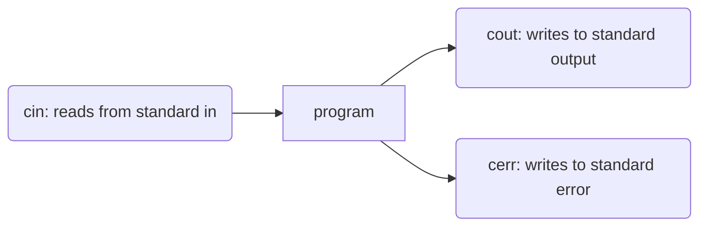

Out of: 82 marks
26 marks: 26 multiple-choice/true-false/multi-select questions filled out on a "bubble-card". Note that if there is more than 1 correct answer for a question, all parts must be selected for the mark and there are no part-marks.
56 marks: 5 short-answer and small programs/scripts/code fragments questions. Sorts of programming questions will be similar to those in assignments/tutorials/lectures, but pared-down somewhat, or writing a subset of a class, or certain functions/methods, code fragments, things like that.
Structure: you will be provided with a question booklet, an answer booklet, and a reference booklet. The answer booklet will have a "bubble" sheet on the last page on which you will enter your answers for the multiple-choice/true-false/multi-select questions. The reference booklet is a copy of the Linux commands PDF you received for A0/A1, and some question information placed there to make it easier to look up needed information.

Topic coverage:
Introduction to Linux and bash
directory structure
what is a shell?
I/O streams
globbing patterns
I/O redirection
pipes
egrep and regular expressions
file permissions
bash scripts (shbang, if, for, variables, special symbols)
Software Engineering: Testing


what is it?
types of testing

# Introduction to C++ (C++14)

```c++
#include <iostream>
version 1: using namespace std;

Or: 
using std::cout;
using std::endl;

int main() {
    cout << "Hello world!" << endl;
    return 0; 
}
```

## 2.1: Compilation 

```bash
g++ hello.cc
g++ -std=c++14 hello.cc // Follows c++14 standard
g++14 hello.cc -o hello // -o allows executable to be renamed `hello`
```

| Command | Explanation |
|---|---|
| | |

## Input and Output 

```c++
#include <iostream>
input >> information;
output << information;
```
The direction of the angle brackets tells us which way the information flows either from stream to variable (`>>`), or from variable to stream (`<<`)

- whitespace, improper int value

```c++
cin.fail()
cin.error()
```

`>>` operator is a reference variable

cin >> x >> y >> z; = operator>>( operator>>( operator>>( cin, x ), y ), z);

>> = std::istream & operator>>( std::istream & in, int & value );

???

## Handling Input Errors 

???

## File I/O
Nearly identical to reading from standrd input. Except, use `fstream` library and use the `ifstream` type

```c++
#include <fstream>
int main() {
    std::ifstream infile{ "input.txt" };
    std::ofstream outfile{ "output.txt" };
    int i;
    while ( true ) {
        infile >> i;
        if ( infile.fail() ) break;
        outfile << i << std::endl;
    }
}
```
When is the fail bit set?

FORMATTING OUTPUT?

# Strings
```
#include <string>
```

literal strings is a C constant character pointer (`const char*`), it is passed in to initialize the string variable. 

### Operations
| Op Type | Code |
|---|---|
| Equality | |
| Inequality | 
| Comparison (lexicographic) | |
| Length | |
| Individual Characters | |
| Concatenation | |

### Input/Output
- repository
- getLine()

## String Streams

...

(PAGE 144)


- (&(*x)) -> (*x) pointer to a &(...) reference

Intro to C++
- using namespace std; as alternative to std::cout, etc. 
- #include <iostream>
- basics on how to compile
- C++ versions of standard input, output and error
- how to read in primitive types such as int, and check for end-of-file or errors
- dealing with errors
- C++ I/O streams
- file I/O
- Strings: std::string
stringstreams
default function parameters
overloading
structures
constants

- parameter passing
- references
- lvalues and rvalues
- passing by reference
- dynamic memory allocation
- returning by value, by pointer, and by reference
- operator overloading

preprocessor
using preprocessor macros for debugging
separate compilation: motivation, issues, using the make tool i.e.[Mm]akefile
use of include guards

- classes (terminology: class, object, member functions/methods, this)
- constructors (uniform initialization syntax i.e. {}, advantages to using, default constructors, member initialization lists i.e. MIL)
- intro to compiler-provided default operations: default ctor, copy ctor, copy assignment, destructor, move ctor, move assignment
- copy ctors
- destructors (dtors)
- copy assignment ???
- copy-and-swap idiom
- move semantics: move ctor/assignment
- copy/move elision

//
- invariants and encapsulation: "class" keyword and effects on visibility (plus types of visibility: public, private)
SE: design patterns
***Iterator design pattern
purpose behind Iterator design pattern
implementation and use code
C++

range-based for loops
encapsulate the solution
- member operators
- arrays of objects
- constant objects
// 
