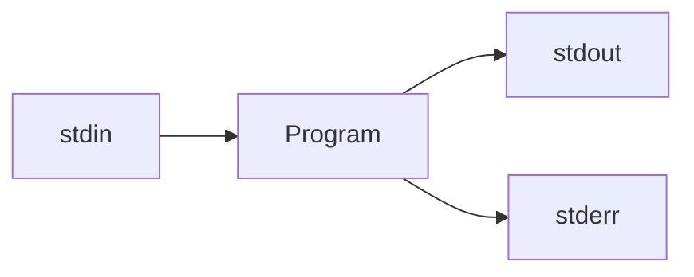

# Module 1: Linux 

*Recall*: Every process is connected to *three streams*.



***Command line arguments***: program recieves immediately when it starts

> 1. `stdin` (standard out) = keyboard, redirected by `<`
> 2. `stdout` and `stderr` = screen, and redircted by `>` and `2>` respectively 

`stdout` may be buffered - the system may accumulate output before sending it out to the OS for printing, this consumes time as "context switching" to give the OS control to so somethig (printing or allocating memory tp the program) is expensive
> Additionally, this allows for error messages to be sent to seperate locations, so regular output can maintain its formatting withoout error messages in between 

*Example A*. 
``` bash
myProg < infile > outfile 2> errfile
```
But, what if we want to run one program with the inout from another program?

```bash
Prog1 > filename
Prog2 < filename
```

## 1.1 Pipes
> ***Pipes*** allow us to ouse the output of one program as the input to another (<span style="background-color: #FFFF00">`|` is the pipe character</span>) 

*Example 1*. How many words occur in the first 20 lines of Alice in Wonderland? 

- `head -n file`: gives the first `n` lines of a file 
- `wc`: counts words, lines and characters, `-w` counts just words 

``` bash
head -20 alice.txt | wc -w // gives the number of words in the first 20 lines of alice.txt
```

*Example 2*. With `words1.txt` and `words2.txt`

*2.1* Print both text files: <span style="background-color: #FFFF00">(globbing patterns)</span>
```bash 
cat words*.txt
```

*2.2* Print both text files *without duplicates*: 
```bash 
cat words*.txt | sort | uniq

> rundown: cat words*.txt (combine) | sort (sort) | uniq (remove adjacent duplicates)
```


So, we can use the output of one patter as the *input* to another, can we also use it as the argument(s) of another program? ***Subshells*** 

## 1.2 Subshells 
> A ***subshell*** is created with the `$(...)` syntax

In the parenthesis `(...)` goes whatever you want to run, then the subshell gets in the outer command with the text it printed 

*Example 1*. 
``` bash
echo "Today is $(date) and I am $(whoami)"
```
Here, the shell executes the commands `date` and `whoami` and substitutes their output into the comand line 

*Example 2*. 
``` bash
echo hello there
``` 
(`hello` and `there` are 2 **distinct** command line arguments) 

> There is a difference between double (`""`) and single quotes (` '' `): <span style="background-color: #FFFF00">No BASH substitution occurs in single quotes</span>

``` bash 
echo "Today is $(date) and I am $(whoami)"
> Today is May 05 2022 and I am Grace

echo 'Today is $(date) and I am $(whoami)'
> Today is $(date) and I am $(whoami)
```

*Example 3.* Let `temp.txt` be 
``` bash 
hello
there
```

``` bash 
echo $(cat tmp.txt)
> hello there

echo "$(cat tmp.txt)"
> hello
> there
```

``` bash
echo * 
> prints all non-hidden filenames in current wording directory 

echo "*" 
> prints *
```
Note: `cat` preserves the spacing of the given input, whereas `echo` may not

## 1.3 Pattern-Matching in Text Files (`egrep`)
> `egrep` ("extended global regular expression print"): prints every line in file that matches the pattern

Formatting: `egrep pattern file`

*Example*. Print every line in `index.html` that contains `cs246`

``` bash 
egrep cs246 index.html
> returns lines with `cs246` (case sensitive)

egrep "(cs|CS)246" index.html [OR] egrep cs246|CS246 index.html
> returns lines with `cs246` or `CS246`

egrep "(c|C)(s|S)246" index.html [OR] egrep "[cC][sS]246" index.html
> returns lines with all instances of `cs246` (not case sensitve) 
```

==The patterns that `egrep` are called **regular expressions** and are not the same as globbing patterns==

| Syntax | Property |
|---|---|
| `[...]` | match any one charcter included in these brackets |
| `[^...]` | match any charcter **not** in these brackets |
| `?` | indicates ==0 or 1== occurances of the ==immediate preceeding pattern== |
| `*` | indicates ==0 or more== occurances of the ==immediate preceeding pattern== | 
| `+` | indicates ==1 or more== of the ==immediate preceeding pattern== | 
| `.` | match **any** single character |
| `.*` | matches any string (including the **empty string**) | 
| `.+` | matches any **non-empty** string | 

Note: `[cC][sS] ?246` allows for an optional space, but `[cC][sS] 246` requires a mandatory space

*Example*

``` bash 
egrep "cs?246" index.html
> looks for `c246`, `cs246`

egrep "(cs)?246" index.html
> looks for all occurances of the words with `246`

egrep "cs.*246" index.html
> fetches lines from `index.html` that contains `cs` followed by any sequence of charcaters, followed by `246`

> ✓ `cs246` `cs is fun, this is 246` `hello, cs gabagol 246 bye` `cs246 is a cs class`
> ✗ `246 is a cs class` (not a match incorrect order) 
```

The special patterns `^` and `$` match respectively with the beginning and end of a line. 

> Thus, the pattern `^cs246$` matches lines that begin and end with `cs246` with nothing in between. 
- `^cs246` matches any line that **starts** with `cs246`
- `cs246$` matches any line that **ends** with `cs246`

*Example*. Fetch all lines of even length from a file: 
``` bash 
^(..)*$
```

*Example*. Fetch the names of all files in current working directory whose name contains **exactly 1 a**: 
``` bash 
^[^a]*a[^a]*$
```

*Example*. Fetch all words in the global dictionary, that are 5 letters long and begin with 'e'
```bash 
$ egrep "^e....$" /usr/share/dict/words

if we dont want apostrophie
$ egrep "^e[^'][^'][^'][^']$"
```


