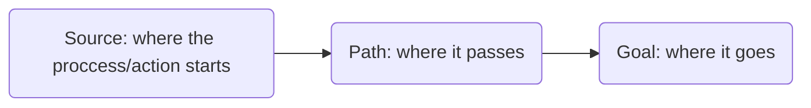
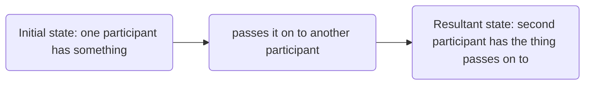

# CH 4 (Path II): Complex Event Schema
### 4.2.6 The "moving" schema
Combination of either then happening schema or the doing schema and outlines: 

The **source-path-goal** schema

| Example | Explanation |
|---|---|
| The apple fell from the tree into the grass. | *“happening” schema + Source – Goal* |
| I climbed from my room up the ladder onto the roof. | *“doing” schema + Source – Path – Goal* |
| It went on from ten all night long till two. | *“happening” schema + Start – Duration – End* |
| She changed from an admirer into his adversary. | *“happening” schema + Initial State – Resultant State* |

**Path** in a concrete *spatial* sense can also be:
- **duration** concept in a *temporal* context
- **two successive states** of being in a *proccess* context

For human actions, there is a **goal-over-source** principle:
$$goal > source \text{ }\text{  and  }\text{ } source \text{, } goal > path$$

### 4.2.7 The "transferring" schema
Combination of different schemas: the "having", "happening" or "doing" schema, and yhe "moving" schema

