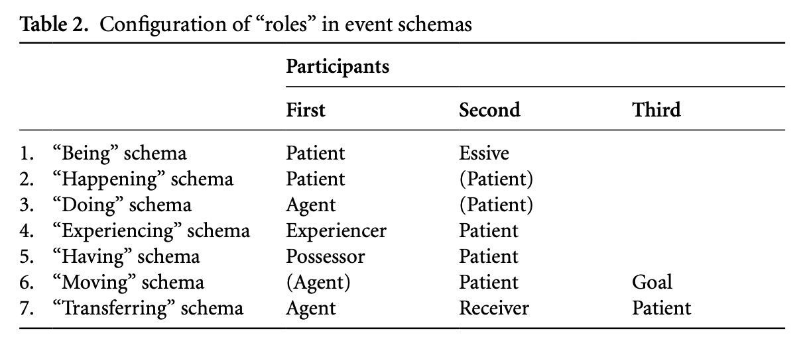
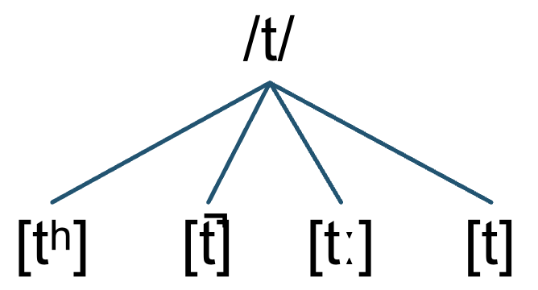

# CH 4 (Part II): Complex Event Schema
### 4.2.6 The "moving" schema
Combination of either then happening schema or the doing schema and outlines: 

The **source-path-goal** schema

| Example | Explanation |
|---|---|
| The apple fell from the tree into the grass. | *“happening” schema + Source – Goal* |
| I climbed from my room up the ladder onto the roof. | *“doing” schema + Source – Path – Goal* |
| It went on from ten all night long till two. | *“happening” schema + Start – Duration – End* |
| She changed from an admirer into his adversary. | *“happening” schema + Initial State – Resultant State* |

**Path** in a concrete *spatial* sense can also be:
- **duration** concept in a *temporal* context
- **two successive states** of being in a *proccess* context

For human actions, there is a **goal-over-source** principle:
$$goal > source \text{ }\text{  and  }\text{ } source \text{, } goal > path$$

### 4.2.7 The "transferring" schema
Combination of different schemas: the "having", "happening" or "doing" schema, and yhe "moving" schema

| Example | Explanation |
|---|---|
| Janice gave Lynn a birthday cake. | Lynn becomes a real possesssor of the entity - she is a *reciever* |
| Jance gave a birthday cake to Lynn. | In this case, Lynn could be a temporary possessor - she is a *Goal*, not nessessarily a reciever |
| Janice gave the door a coat of paint | Door is a *reciver* |

In summary, generally: 
1. X gave Y some Z - Y is a reciever of Z
2. X gave Z to some Y - Y is a goal for Z

## Sentence structure?????? ill do it tommorrow

# CH 5 The Sounds of Language: Phonetics and Phonology
## 5.1.5 Spelling and Pronounciation
Some spellings are influenced by a speaker;s deliefs about etymology (**etymological spelling**): *Debt* is a borrowing from the Old French *dette*, and the *b* (not pronounced) was inserted to show the relationship to Latin *debitum*

## Production of Sound Speeches
- Phonotation: modulation of the airstream in the glottis
- Articulation

phoneme: abstract representation of a class of sounds (allaphone)

`\t\' is a phonome

5.2.1 Phontation
Voiced vs voiceless
[s] - voiceless 
[z],[u] - voiced sounds

- constants: involve some major obstruction in the airflow
- vowels: realively little impedance of the airflow, but oral cavity is shaped in many different ways - different vowels and *diphthongs*

sonorant: class of constant that are typically voices ("hummable" constants)

| Sonorant | Example |
|---|---|
| [m] | "me" |
| [n] | "knee" |
| [ŋ] | "sing" |
| [l] | "love" |
| [r] | "ray" |
| [j] | "yes" |
| [w] | "when" |

Vowels

- [i]: high and front
- [u]: high and back
- [a]: low and front
- [o]: low and back

