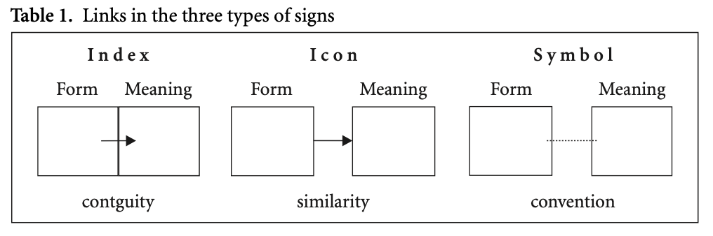
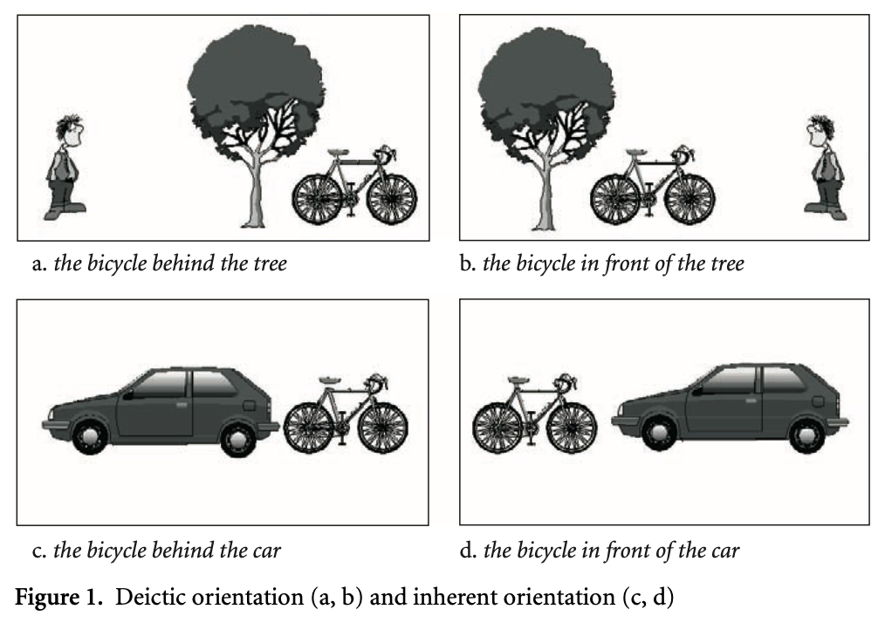

# CH 1. The Cognitive Basis of Language: Language and Thought

> **Semiotics**: studies system of signs - the study of the relationship between the signans (“signifier”, material) and the signatum (“signified”, conceptual)[meaningfulness]

## § 1.1 Sign Systems

| Sign System | Definition |
|---|---|
| **`Indexical Sign (index)`** | Points to something in its immediate vicinity→ *(direct, causal)* |
| **`Iconic sign (icon)`** | A visual, auditory, or perceptional image of what the thing stands for → *(similarity, resemblance)* |
| **`Symbolic sign (symbol)`** | Does not have a natural link between the signan and signatum, but rather a conventional link → *(metaphorical, arbitrary)*<ul><li> Is a learned relationship between the signan and signatum </li><li> Language is symbolic </li></ul> |

## § 1.2 Structuring principles in Language

> **Principle of indexicality**: “point” to things in our scope of attention

- *Egocentricity*: Our position in time and space serves as the reference point for location  
	- *Deictic expressions*: Words such as *here, there, now, then, today, tomorrow, this, that, come and go* as well as the personal pronouns ***I, you and we***
	- *Deictic orientation*: orientation where we are the reference point 
	- *Inherent orientation*: orientation where  an artifact (which we assume as an extension of our body) is the reference point 
- *Anthropocentricity*: If a human being is involved in an event, they to be named first, as the subject of the sentence.

> **Principle of iconicity**: conceive a similarity between a form of language and the thing it stands for (*ex*. Cuckoo: name of bird imitates the sound it makes)

| Principle | Explanation and Examples |
| --- | --- |
| **`Principle of sequential order`** | The phenomenon where linear order is related to the order of events (iconic)<ul><li>*Ex*. Virginia got married and had a baby</li><li>Bill painted the *green* door vs. Bill painted the door *green*</li></ul> |
| **`Principle of distance`** | Things which belong together conceptually tend to be put together linguistically, and things that do not belong together are put at a distance <ul><li>Ex. I *made* her leave vs. I hoped *that she would* leave - in the first, I had a _direct influence (minimal distance)_. In the second, the _subject’s desire may have had some impact (greater distance between the verbs)_ </li></ul> |
| **`Principle of quantity`** | The tendency to associate more form with more meaning and less form with less meaning (*ex*. Elongate: *loooooooong* story, repetition **(reduplication)**: *many, many, many* trees) 

> **Principle of Symbolicity**: the conventional pairing of form and meaning

- *Motivation*: non-arbitrary links between a form and meaning of a linguistic expression 
- *Folk etymologies*: incorrect assumptions of a word (mistraslation, etc.)