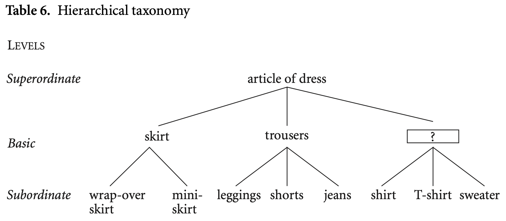

# CH 1. The Cognitive Basis of Language: Language and Thought

> **Semiotics**: studies system of signs - the study of the relationship between the signans (“signifier”, material) and the signatum (“signified”, conceptual)[meaningfulness]

## § 1.1 Sign Systems

| Sign System | Definition |
|---|---|
| **`Indexical Sign (index)`** | Points to something in its immediate vicinity→ *(direct, causal)* |
| **`Iconic sign (icon)`** | A visual, auditory, or perceptional image of what the thing stands for → *(similarity, resemblance)* |
| **`Symbolic sign (symbol)`** | Does not have a natural link between the signan and signatum, but rather a conventional link → *(metaphorical, arbitrary)*<ul><li> Is a learned relationship between the signan and signatum </li><li> Language is symbolic </li></ul> |

## § 1.2 Structuring principles in Language

> **Principle of indexicality**: “point” to things in our scope of attention

- *Egocentricity*: Our position in time and space serves as the reference point for location  
	- *Deictic expressions*: Words such as *here, there, now, then, today, tomorrow, this, that, come and go* as well as the personal pronouns ***I, you and we***
	- *Deictic orientation*: orientation where we are the reference point 
	- *Inherent orientation*: orientation where  an artifact (which we assume as an extension of our body) is the reference point 
- *Anthropocentricity*: If a human being is involved in an event, they to be named first, as the subject of the sentence.

> **Principle of iconicity**: conceive a similarity between a form of language and the thing it stands for (*ex*. Cuckoo: name of bird imitates the sound it makes)

| Principle | Explanation and Examples |
| --- | --- |
| **`Principle of sequential order`** | The phenomenon where linear order is related to the order of events (iconic)<ul><li>*Ex*. Virginia got married and had a baby</li><li>Bill painted the *green* door vs. Bill painted the door *green*</li></ul> |
| **`Principle of distance`** | Things which belong together conceptually tend to be put together linguistically, and things that do not belong together are put at a distance <ul><li>Ex. I *made* her leave vs. I hoped *that she would* leave - in the first, I had a _direct influence (minimal distance)_. In the second, the _subject’s desire may have had some impact (greater distance between the verbs)_ </li></ul> |
| **`Principle of quantity`** | The tendency to associate more form with more meaning and less form with less meaning (*ex*. Elongate: *loooooooong* story, repetition **(reduplication)**: *many, many, many* trees) 

> **Principle of Symbolicity**: the conventional pairing of form and meaning

- *Motivation*: non-arbitrary links between a form and meaning of a linguistic expression 
- *Folk etymologies*: incorrect assumptions of a word (mistraslation, etc.)

## § 1.3 Linguistic and Conceptual Categories
> **Conceptual categories** which are laid down in a language are linguistic categories (linguistic signs)
> 
> **Lexical definition** of a term, is the definition closely matching the meaning of the term in common usage

***Construal***: Each person's choice between various alternatives (ex. Calling a half-filled glass: half-full vs. half-empty)

Conceptual categories may also show up as ==grammatical categories==: *Ex*. rain can be construed as two different word classes: *noun* and *verb* 

! Each lexical category is at the same time a grammatical category: lexical categories are defined by their specific content, grammatical categories provide the structural framework for lexical material 

# CH 2. What’s in a Word? Lexicology 

img: the semiotic triangle

The word form is *significant (which signifies)*, and the meaning of the word is the *signifié (that which is signified)*

## § 2.1 Introduction: Words, Meanings, and Concepts

> **Classical definition**: a definition that lists all the necessary and sufficient conditions for something to be a member of a category.

## § 2.2 From words to meanings: Semasiology (Relationship of same word in Different Senses)

> **Semasiology**: describes the polyester of a word form and the relationship between the various definitions

>> **Polysemous word** (from Greek poly ‘many’ and sema ‘sign, meaning’): a word with different related senses

***Prototypical (central) members*** → *centrality effect* → subtype that first comes to mind when we think of that category (conspicuousm or salient) [fruit → apple]

***Peripheral (marginal) members*** → Member with less frequent first association [fruit → durian]

### Link Between Work Senses: Radial network 
|Type of Link to Central Definition|Meaning|
|---|---|
| **`Metonymy`** | Basic ==meaning of a word can be used for a part or a part of a whole== <ul><li>In metonymy, the semantic link between two or more senses of a word is based on a relationship of *contiguity* [schooling → i.e between the whole of something (school as an institution), and a part of it (its lessons)]</li></ul>|
| **`Metaphor`** | Based on perceived similarity (source domain to explain a target domain) |
| **`Specialization`**| Words original meaning is narrowed fown to a smaller set of special referrants |
| **`Generalization`** | Original meaning is broadened| 

*Ex. Dog* 
>1. dog, $n.^1$: A domesticated carnivorous mammal
- dog, $n.^2$: As a way of distinguishing sex: a male dog, as opposed
to a female one; contrasted with *bitch*
- dog, $n.^3$: Denoting a person or thing (with varying degrees of contempt or admiration)
- dog, $n.^4$: slang (originally U.S.). A horse that is slow, worthless, or difficult to handle
- dog, $n.^5$: A heavy clamp for supporting something (e.g. part of a building), or fastening or holding it in place.
- dog, $v.^1$: *transitive*. To follow like a dog on the heels of; to track (a person, or his or her trail, footsteps, etc.) closely and persistently.
- dog, $v.^2$: *transitive*.To fasten or secure by means of a dog (see dog $n.^5$).
- dog, $v.^3$: *transitive*.To shirk, avoid (a duty or responsibility); to undertake half-heartedly.

- `Metonymization`: Based on correlation/contiguity ($v.^2$)
- `Metaphorization`: Based on resemblance ($n.^3$ , $n.^4$: comparison of the speed of a slow racing horse to a dog, $n.^5$: comparison to dog jaws ,$v.^1$: comparison to dog behaviours, $v.^3$)
- `Specialization`: Narrower sense [$n.^2$: dog (general) → male dog (specific)]
- `Generalization`: Wider sense (historical expansion of dog: [dog (historical): specific breed → dog (contemporary): all canine breeds]

> **Homonymy**: two different words (_different meanings_) having the same form (sound, spelling)

*Ex*: here/hear, pen(writing utensil)/pen(animal pen), bat(animal)/bat(baseball), real/reel, etc. 

## § 2.3 From Concepts to Words: Onomasiology (Relationship of Hierarchial words)

> **Lexical field**: collection of words that are all in the same conceptual domain - *breakfast, lunch, brunch* - belong to same lexical field (meals)

**Salience effect in onomasiology**: certain term in the hierarchy (animal, canine, dog) is thought of first

**Entrenchment**: choice of one particular member of a category is more prominently used (ex. miniskirt over wrap-over skirt)

### Taxonomies

(?) - **lexical gap**: no basic level term where we expect one

> **Hypernynm (parent, superordinate)** - ex. vehicle is a hypernynm of car
> 
> **Basic level term** a word used most readily to refer to a given phenomenon (evel where salience effects are most outspoken)
> 
> **Hyponym (child, subordinate)** - sports car is a hyponym of car

### Conceptual metonymy

# CH 3. Meaningful Building Blocks: Morphology 

> **Morphology**: study of morphemes (building elements used to form composite words or grammatcal units)

## § 3.1 Introduction

### Building: Composite Words (Using Morphemes)

| Type of Morpheme | Definition |
|---|---|
| **`Free morphemes`** | ==Independent morphemes== that can occur on their own (_simple words_) |
| **`Bound Morphemes`** | ==Dependent morphemes== which cannot occur own their own (_affixes_) |

Two main ways of building composite words: **`COMPOUNDING`** and **`DERIVATION`**

*Ex. **Complex composites** - _More than one word-formation processes_ may be involved in forming one composite word* (Harris Notes: Complex → compound or derivations) 

| Type of Affix | Property |
|---|---|
| **`Prefix`** | Bound morpheme *before* stem (ex. *un*kind)|
| **`Suffix`** | Bound morpheme *after* stem (ex. willing*ness*)|
| **`Infix`** | Bound morpheme *between* stems (ex. speed*o*meter)| 

`Circumfixes`: bound morphemes on either side of stems `{pre}-{post}` - english doesn't really have circumfixes 

### Building: Grammatical Units (Using Grammatical Morphemes)

| Gramatical morpheme | Property |
|---|---|
| **`Content words`** | Most free words (ex. book, like) | 
| **`Function words`** | Free grammatical morphemes (ex. to in "to go")|
| **`Bound morphemes`** [inflection morphemes] | Changes tense, plural, etc. (ex. -s in "he likes", "chickens") |

> **Syntatic group**: A (*function word*) and one or more {*content words*} → ex. "(a) {very} {nice} {present}"
> 
> **Inflected forms**: words combined with *bound gramatical morphemes*

## § 3.2 Compounding 

In a compound: generally the second element that determines the compound's new word class (**head** - belongs in either noun, verb, or adjective) 

> **Conceptual blending**: elements from two concepts are "blended" into a new, more complex concept

| Compound Type | Example |
|---|---|
| **`Noun compounds`** | <ol><li>*noun + noun* = kitchen chair, wheel-chair</li><li>*verb + noun* = rocking chair, swivel chair</li><li>*adjective + noun* = highchair, easy chair</li></ol> |
| **`Verb compounds`** | <ol><li>*noun + verb* = to vacuum-clean, to manhandle</li><li>*verb + verb* = to sleep-walk, to blow-dry</li><li>*adjective + verb* = to dry-clean, to highlight</li></ol> |
| **`Adjective compounds`** | <ol><li>*noun + adjective* = colour-blind, duty-free</li><li>*verb + adjective* = soaking wet, stinking rich</li><li>*adjective + adjective* = dark-blue, pale yellow</li></ol> |

### Compounds vs. Syntactic Groups 

Compounds vs. Syntactic groups: different stresses

The phonological difference is accompanied by fundamental differences in meaning: compounds have a meaning of their own (ex. blackbird → is a breed of birds, female blackbirds are actually "brown birds", hence different meaning from its syntatical counterpart)

## § 3.3 Derivation 

### Derivational Affix vs. Inflection Affixes 

**Derivational affixes**: restricted in their applications, whereas **inflectional affixes**: can be applied to all members in a given linguistic category 

*Ex.* all nouns can have a plural (inflection) affix, but not all adjective can take on the derivational *-less*

> **Grammaticalization**: process whereby a once free morpheme aquires the function of an affix/gramatical morpheme. (ex. full → -ful)

### Meaning and Productivity of Affixes 

| Form | Definition |
|---|---|
| **`[un- + A]`** | — “lacking the property of A, even implying its opposite” (*ex*. untouchable) |
| **`[V- + -able]`** | — “having the inherent capacity of being V-ed” (*ex*. edible, buyable)|
| **`[V + -er]`** | — “a human being or other force that is functionally linked to the event of V” (*ex*. eraser, builder, eye-opener) |

## § 3.4 Other Word-formation Processes 

| Word form Processes | Property | Example |
|---|---|---|
| ==**`Conversion`**== | Changing the class status | clean → to clean (adjective → verb) |
| ==**`Back Derivation`**== | Derive a new word from an earlier, more complex form; then meaning of a backderivation is often far more general than its source | television → to televise |
| ==**`Lexical Blending`**== | Special case of conceptual blending - uses phonological strings symbolizing the concepts | (br)eakfast + l(unch) → brunch|
| **`Clipping`** | Part of the original word is cut off | advertisment → ad|
| **`Acronym`** | Words composed of the first letter(s)/symbol(s) of a series of words | United Kingdom → UK|

## § 3.5 Inflection and Functional Words

- ==Derivational morphology usually _changes the word class status_ of forms== (book -> bookish), where as inflectional morphology does not (book - books)
- Derivational morphemes are added before gramatical morphemes (Ex. look(er)[s])
- Derivations: an affix is only attached to a stem in one of its meanings, strongly limiting the range of application (someone is _waiting_ at the busstop and someone is _waiting_ upon the customers, but a _waiter_ only denotes the profession)

### Inflectional morphemes 

- ***Nomial***: (plural `-s`, genetive `'s` variants) 
- ***Verbal***: (changing tenses)

Allomorphs - (mouse -> mice, sheep - sheep)

# CH 4. Putting Concepts Together: Syntax

## § 4.1 Introduction: Syntax and grammar 

Clause: Complete thought - is made up of a **subject** and a **predicate**
Sentence: multi-clausal 

Syntax: arranges together elements of a sentence by means of *regular patterns*

Subject: The one doing something, direct object: the thing being done something to

## § 4.2 Event Schemas and Participant Roles 

> **Event Schema**: Conceptual event of a schema

| Simple types of Schema | Elements/ideas |
|---|---|
| **`"Being" schema`** | *Who or what is some entity (like)?*<ul><li>relate a characteristic or conceptual category to a given entity</li><li>==**Patient**==: role of the main participant in the "being" schema, least invloved in any kind of relationship</li><li>Essive: any role related to the patient via a "being" link</li></ul>|
| **`"Happening" schema`** | *What is happening?*<ul><li>Have an entity (patient) that does not contricute to energy developed in an ongoing process, but rather undergoes it</li></ul>|
| **`“Doing” schema:`** | *What is someone doing? What does he or she do?*<ul><li>Have an entity (**agent**) that is the source of the energy that is developed, instigating the action</li><li>Happening vs. Doing schema: (Doing) - **_controllable action_** rather than an instinctive process → *Doing schema is almost exclusively linked to human agents*</li></ul>|
| **`“Experiencing” schema:`** | *What does someone feel, see, etc.?* - mental processing of the contact with the world <ul><li>Usually have verbs *to see, to feel, to know, to think, to want, to hear, etc.* </li><li>entity in the experiencing schema is the **experiencer**, neither passive (patient) or active (agent), but is a "registration center" of these perceptions, emotions, thought processes, and wants</li></ul>|
| **`“Having” schema:`** | *What does an entity have?* - The entity is the **possessor**, much like a patient (have, with)|

## § 4.3 Hierarchical and Linear Structure of the sentence 

1. ***Linear structure***: word order
2. ***Hierarchial structure***: Grouping of parts of sentence in a hierarchial structure

### Sentence Patterns

- Subject 
- Predicate phrase: all that is predicated by the subject of the sentence
- Direct object (NP)
- Indirect object (NP)
- Complements: Constituients of the sentence other than the subject, indirect object, or direct object (also used to characterize verb-like structures after a verb such as a *to*-infinitive)

| Pattern | Properties | Example |
|---|---|---|
| **`Intrasitive`** | (Subject) | |
| **`Transitive`** | (Subject, Direct object) | |
| **`Ditransitive`** | (Subject, Direct object, Indirect object) | |
| **`Copulative`** | (Subject, V_cop, Complement) | |
| **`Complement`** | (Subject, Complement) | |
| **`Transitive complement`** | (Subject, Direct object, Complement) | |

# CH 9. Language Across Time: Historical Linguistics 

## Symbol Theories 

| Symbol Theory | Property | Migration | Example |
|---|---|---|---|
| **`Bow-wow`** | Making noise to represent elements in the enviornment | (index) → icon → symbol| animals, rain, expulsive gas |
| **`Pooh-pooh`** | Making noise to represent emotional sounds | index → icon → symbol | sighs, yelps, cries |
| **`Ye-ho-ha`** | Making noise to represent social-coordination sounds | index → icon → symbol | chants, rhythmic calls |

Ye-ho-ha adds prosody (intonation)

## Symbols and Syntax: Kapow vs. Piggybacking 

- Kapow: one major, isolated mutation (recursion)
- Piggybacking: a series of shaped mutations exploiting existing structures (exaption)

La la la theory: Language is a prelinguistic musical mode of thought and action 

#### Communicative system 

- Holistic
- Rhetorical
- Rhythmic (indexical)
- Melodic (indexical)
- Mimetic (iconic)

Yadda, yadda, yadda

## Langauge Origins

- Bow-wow, pooh-pooh, ye-ho: lexical, social 
- Yadda, yadda, yadda: non-lexical, syntactic, exaptive (piggybacking), social
- Ye-ho-ha, Hmmm: Lexical, syntacticm exaptive (piggybacking), cognitive-social

Mutability 

Language change 
- ***Internal***: fashion, prestige, ..., identity & power
- ***External***: trade, war, imperialism, ..., identity & power

Familial patterns 

- ***Regiolects***: _geograohically-based_ group speech differences 
- ***Sociolects***: _class-based_ group speech difference 
- ***Ethnolects***: *tribal-based* group speech differences 
- ***Aetalect***: _age difference_ in languages 
- ***Idiolects***: Language peculiars of a single speaker 

Semantic change: Hyponym/hypernym swap

Ancestor language: Proto-Indo-European
